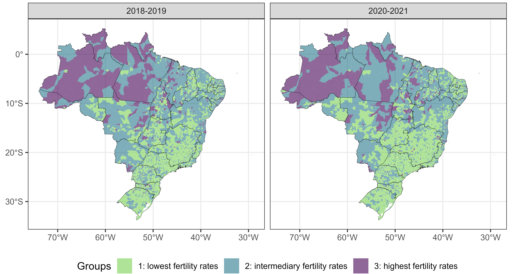
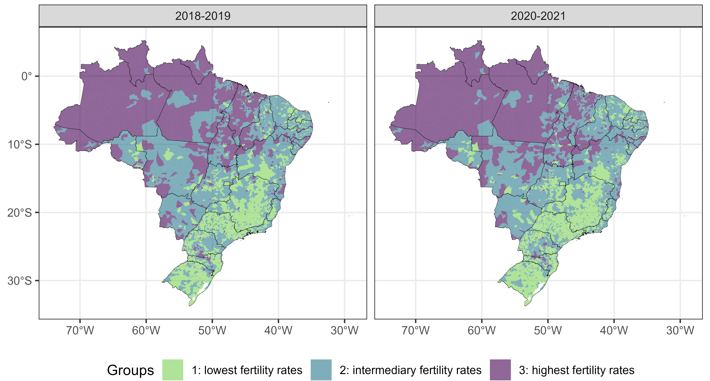

```{r setup, include=FALSE}
knitr::opts_chunk$set(warning = FALSE, message = FALSE, fig.align = "center", fig.width = 6, fig.height = 4, fig.pos='H')
options(scipen = 999)
```


# Introduction

This document aims to redo the analyses made for the article “Fertility rate among adolescents in Brazil in the period 2012-2021: effects of human development, primary care coverage and the COVID-19 pandemic” using a correction for the numbers of live births based on under-registration estimates, aiming to show that the original analyses are not significantly affected by the lack of this correction.

# Importing the necessary packages

```{r}
library(knitr)
library(kableExtra)
library(reactable)
library(dplyr)
library(glue)
library(tidyr)
library(ggplot2)
library(trend)
library(factoextra)
library(clusterSim)
library(clValid)
library(htmltools)
library(gridExtra)
library(grid)
library(rstatix)
library(sf)
library(geobr)
library(corrplot)
library(gamlss)
```

# About the dataset

```{r}
# Importing the dataset
df_indicadores <- read.csv("databases/data_fertility_rates_article.csv") |>
  mutate(
    regiao = factor(
      regiao,
      levels = c("Norte", "Nordeste", "Centro-Oeste", "Sudeste", "Sul")
    )
  )
```


## Variables description

The dataset used in this study included variables available on several different databases. To obtain the variables from SINASC (more specifically, the number of births of mothers in each age group), we used the `{microdatasus}` package in R. To obtain the population estimates for each age group, we used [Tabnet DATASUS](http://tabnet.datasus.gov.br/cgi/deftohtm.exe?ibge/cnv/popsvs2024br.def) (using the updated estimates after the 2022 census). To obtain the number of women beneficiaries of private health plans (used for calculating the percentage of women who exclusively use the SUS), we used [Tabnet ANS](https://www.ans.gov.br/anstabnet/cgi-bin/dh?dados/tabnet_02.def). To obtain the variables used to calculate the Primary Care coverage, we used the “e-Gestor Atenção Primária à Saúde” platform. Finally, to obtain the HDI-M, we used [Atlas Brasil](http://www.atlasbrasil.org.br/). All data was obtained for the period 2012 to 2021. A description of the variables included in the file `data_fertility_rates_article.csv` can be seen in **Table \@ref(tab:descricao-variaveis)**.

```{r descricao-variaveis, echo=FALSE}
library(kableExtra)

kbl(
  data.frame(
    variavel = c(
      "codmunres",
      "municipio",
      "uf",
      "regiao",
      "ano",
      "nvm_10_a_14",
      "nvm_15_a_19",
      "nvm_10_a_19",
      "pop_feminina_10_a_14",
      "pop_feminina_15_a_19",
      "pop_feminina_10_a_19",
      "pop_feminina_10_a_49",
      "idhm",
      "media_cobertura_ab",
      "populacao_total",
      "pop_fem_10_49_com_plano_saude"
    ),
    descricao = c(
      "Municipality code",
      "Municipality name",
      "Federative Unit",
      "Brazilian Region",
      "Year",
      "Live births of mothers aged 10 to 14 years",
      "Live births of mothers aged 15 to 19 years",
      "Live births of mothers aged 10 to 19 years",
      "Estimated female population aged 10 to 14 years",
      "Estimated female population aged 15 to 19 years",
      "Estimated female population aged 10 to 19 years",
      "Estimated female population aged 10 to 49 years",
      "HDI-M",
      "Population covered by Primary Care teams",
      "Total population",
      "Female population aged 10 to 49 years with private health insurance"
    ),
    fonte = c(
      "SINASC",
      "SINASC",
      "SINASC",
      "SINASC",
      "---",
      "SINASC",
      "SINASC",
      "SINASC",
      "Tabnet DATASUS",
      "Tabnet DATASUS",
      "Tabnet DATASUS",
      "Tabnet DATASUS",
      "Atlas Brasil",
      "e-Gestor Atenção Primária à Saúde",
      "e-Gestor Atenção Primária à Saúde",
      "Tabnet ANS"
    )
  ),
  "latex",
  align = "lcc",
  col.names = c("Variable", "Description", "Source"),
  caption = "Description of the variables in the dataset.",
) |>
  kable_styling(latex_options = c("scale_down", "HOLD_position")) |>
  row_spec(0, bold = TRUE) |>
  column_spec(2, width = "7cm") |>
  column_spec(3, width = "4cm")
```


## Missing data 

The only variable in the data set that contained missing information was the HDI-M. The five municipalities with missing HDI-M were removed from the dataset only for the modeling phase. 

```{r}
# Checking for NAs
colSums(is.na(df_indicadores))

# Checking which municipalities had missing HDI-M
unique(df_indicadores$municipio[is.na(df_indicadores$idhm)])
```

## Municipalities with zero births and under-registration

As it can be seen in **Table \@ref(tab:zero1)**, all the years in the considered period included municipalities that had no births from mothers in each age group. 

```{r zero1}
# Checking how many municipalities had 0 births from mothers in each age group per year
kbl(
  df_indicadores |>
  group_by(ano) |>
  summarise(
    municipalities_zero_births_10_to_14 = sum(nvm_10_a_14 == 0, na.rm = TRUE),
    municipalities_zero_births_15_to_19 = sum(nvm_15_a_19 == 0, na.rm = TRUE),
    municipalities_zero_births_10_to_19 = sum(nvm_10_a_19 == 0, na.rm = TRUE)
  ) |>
  ungroup(),
  col.names = c(
    "Year",
    "Municipalities with zero births (10-14)", 
    "Municipalities with zero births (15-19)", 
    "Municipalities with zero births (10-19)"
  ),
  align = "cccc",
  caption = "Municipalities with zero births in each year for each age group (before
    the correction)."
) |>
  kable_styling(latex_options = c("scale_down", "HOLD_position")) |>
  row_spec(0, bold = TRUE) |>
  column_spec(1:4, width = "4cm")
```

In addition, as it can be seen in **Table \@ref(tab:zero-total)**, 227 municipalities had no births from mothers aged 10 to 14 in the entire period. 

```{r zero-total}
# Checking how many municipalities had 0 births in the whole period for each age group
kbl(
  df_indicadores |>
  group_by(codmunres) |>
  summarise(
    all_zeros_10_to_14 = all(nvm_10_a_14 == 0, na.rm = TRUE),
    all_zeros_15_to_19 = all(nvm_15_a_19 == 0, na.rm = TRUE),
    all_zeros_10_to_19 = all(nvm_10_a_19 == 0, na.rm = TRUE)
  ) |>
  summarise(
    municipalities_with_all_zeros_10_to_14 = sum(all_zeros_10_to_14),
    municipalities_with_all_zeros_15_to_19 = sum(all_zeros_15_to_19),
    municipalities_with_all_zeros_10_to_19 = sum(all_zeros_10_to_19)
  ) |>
  ungroup(),
  col.names = c(
    "Municipalities with zero births in the while period (10-14)", 
    "Municipalities with zero births in the while period (15-19)", 
    "Municipalities with zero births in the while period (10-19)"
  ),
  align = "ccc",
  caption = "Municipalities with zero births in the entire period for each age group
    (before the correction)."
) |>
  kable_styling(latex_options = c("scale_down", "HOLD_position")) |>
  row_spec(0, bold = TRUE) |>
  column_spec(1:3, width = "4cm")
```


In an attempt to take into account factors such as under-registration of the number of live births in small municipalities, we tried to correct the numbers of births using the SINASC under-registration estimates provided by the [IBGE](https://www.ibge.gov.br/estatisticas/sociais/populacao/26176-estimativa-do-sub-registro.html). The output below summarizes the SINASC coverage statistics presented by IBGE for Brazilian municipalities from 2015 to 2021.

```{r}
# Reading a dataset with SINASC under-registration estimates
df_cobertura_sinasc <- read.csv("databases/dados_cobertura_sinasc_2015_2021.csv")

df_cobertura_sinasc |>
  select(cobertura_sinasc) |>
  summary()
```

The lowest coverage was observed in Condor (Rio Grande do Sul), with 24% in 2015. However, as we can see, the vast majority of municipalities exhibited very high coverage, with the first quartile at 98.4%. Futhermore, despite a small decrease in the number of municipalities that did not report births in each age group, as we can see in **Table \@ref(tab:zero2)**., we decided not to use this approach for the main analyses because: 

1) SINASC under-registration estimates are only available from 2015 onwards, preventing their use in the temporal analyses covering the entire period from 2012 to 2021;

2) not all municipalities contained under-registration estimates; 

3) even for the analyses in which we could make this correction for the entire period considered (i.e the cluster analyses and modeling), new fitting attempts revealed that the correction had minimal influence on the results - for the modeling, for instance, the differences in the estimated coefficients were at most 5%, and the differences in the interpretations obtained were at most 2%.

For these reasons, and considering that the macro-level patterns remained unchanged, we opted to calculate the fertility rates in their raw form, without applying additional correction techniques. Therefore, this supplementary material aims to redo the original analyses, correcting the numbers of births using under-registration estimates, aiming to show that the results obtained are not significantly affected by this correction.

Note: since SINASC under-registration estimates are only available from 2015 onwards, the first stage of the article's analyses, in which we performed a temporal analysis of the period from 2012 to 2021, could not be reproduced in this supplementary material.


```{r}
# Adjusting the number of births according to the under-registration estimates
df_indicadores_corrigido <- df_indicadores |>
  left_join(df_cobertura_sinasc) |>
  filter(ano >= 2015) |>
  mutate(
    nvm_10_a_14_corrigido = round(nvm_10_a_14 * 100 / cobertura_sinasc),
    nvm_15_a_19_corrigido = round(nvm_15_a_19 * 100 / cobertura_sinasc),
    nvm_10_a_19_corrigido = round(nvm_10_a_19 * 100 / cobertura_sinasc)
  ) |>
  mutate(
    nvm_10_a_14_corrigido = ifelse(is.na(nvm_10_a_14_corrigido), nvm_10_a_14, nvm_10_a_14_corrigido),
    nvm_15_a_19_corrigido = ifelse(is.na(nvm_15_a_19_corrigido), nvm_15_a_19, nvm_15_a_19_corrigido),
    nvm_10_a_19_corrigido = ifelse(is.na(nvm_10_a_19_corrigido), nvm_10_a_19, nvm_10_a_19_corrigido),
  )  
```

```{r zero2}
# Checking how many municipalities had 0 births in each age group per year after the correction
kbl(
  df_indicadores_corrigido |>
  group_by(ano) |>
  summarise(
    municipalities_zero_births_10_to_14 = sum(nvm_10_a_14_corrigido == 0, na.rm = TRUE),
    municipalities_zero_births_15_to_19 = sum(nvm_15_a_19_corrigido == 0, na.rm = TRUE),
    municipalities_zero_births_10_to_19 = sum(nvm_10_a_19_corrigido == 0, na.rm = TRUE)
  ) |>
  ungroup(),
  col.names = c(
    "Year",
    "Municipalities with zero births (10-14)", 
    "Municipalities with zero births (15-19)", 
    "Municipalities with zero births (10-19)"
  ),
  align = "cccc",
  caption = "Municipalities with zero births in each year for each age group (after
    the correction)."
) |>
  kable_styling(latex_options = c("scale_down", "HOLD_position")) |>
  row_spec(0, bold = TRUE) |>
  column_spec(1:4, width = "4cm")
```


# Phase 2: Cluster analysis

```{r eval=FALSE, include=FALSE}
# Preparing the data
## Filtering and calculating the fertility rates for each period
df_indicadores_18_19 <- df_indicadores_corrigido |>
  filter(ano %in% c(2018, 2019)) |>
  group_by(codmunres) |>
  summarise(
    tx_fecundidade_10_a_14 = round(
      sum(nvm_10_a_14_corrigido) / sum(pop_feminina_10_a_14) * 1000,
      1
    ),
    tx_fecundidade_15_a_19 = round(
      sum(nvm_15_a_19_corrigido) / sum(pop_feminina_15_a_19) * 1000,
      1
    ),
    cobertura_ab = round(
      sum(media_cobertura_ab) / sum(populacao_total) * 100,
      1
    ),
    porc_exclusivas_sus = round(
      sum(pop_fem_10_49_com_plano_saude) / sum(pop_feminina_10_a_49) * 100,
      1
    ),
    idhm = mean(idhm)
  ) |>
  ungroup()

df_indicadores_20_21 <- df_indicadores_corrigido |>
  filter(ano %in% c(2020, 2021)) |>
  group_by(codmunres) |>
  summarise(
    tx_fecundidade_10_a_14 = round(
      sum(nvm_10_a_14_corrigido) / sum(pop_feminina_10_a_14) * 1000,
      1
    ),
    tx_fecundidade_15_a_19 = round(
      sum(nvm_15_a_19_corrigido) / sum(pop_feminina_15_a_19) * 1000,
      1
    ),
    cobertura_ab = round(
      sum(media_cobertura_ab) / sum(populacao_total) * 100,
      1
    ),
    porc_exclusivas_sus = round(
      sum(pop_fem_10_49_com_plano_saude) / sum(pop_feminina_10_a_49) * 100,
      1
    ),
    idhm = mean(idhm)
  ) |>
  ungroup()

## Standardizing the data for each of the four cluster analysis
dados1_18_19 <- df_indicadores_18_19 |>
  select(tx_fecundidade_10_a_14) |>
  scale()
dados2_18_19 <- df_indicadores_18_19 |>
  select(tx_fecundidade_15_a_19) |>
  scale()

dados1_20_21 <- df_indicadores_20_21 |>
  select(tx_fecundidade_10_a_14) |>
  scale()
dados2_20_21 <- df_indicadores_20_21 |>
  select(tx_fecundidade_15_a_19) |>
  scale()

## Calculating the distance matrices
dados1_18_19_dist <- dist(dados1_18_19, method = "euclidean")
dados2_18_19_dist <- dist(dados2_18_19, method = "euclidean")

dados1_20_21_dist <- dist(dados1_20_21, method = "euclidean")
dados2_20_21_dist <- dist(dados2_20_21, method = "euclidean")

# For the 10 to 14 age group
## K-Means
### 2018-2019
#### Ploting the k-means knee-plot for the 2018-2019 period
kneeplot_kmeans_10_14_18_19 <- fviz_nbclust(dados1_18_19, kmeans, method = "wss")
saveRDS(kneeplot_kmeans_10_14_18_19, "r_objects/02_under_registration_corrected/kneeplot_kmeans_10_14_18_19.RDS")

#### Adjusting the k-means method with the chosen numbers of clusters
set.seed(1504)
d1_kmeans3_18_19 <- kmeans(dados1_18_19, 3)

set.seed(1504)
d1_kmeans4_18_19 <- kmeans(dados1_18_19, 4)

### 2020-2021
#### Ploting the k-means knee-plot for the 2020-2021 period
kneeplot_kmeans_10_14_20_21 <- fviz_nbclust(dados1_20_21, kmeans, method = "wss")
saveRDS(kneeplot_kmeans_10_14_20_21, "r_objects/02_under_registration_corrected/kneeplot_kmeans_10_14_20_21.RDS")

#### Adjusting the k-means method with the chosen numbers of clusters
set.seed(1504)
d1_kmeans3_20_21 <- kmeans(dados1_20_21, 3)

set.seed(1504)
d1_kmeans4_20_21 <- kmeans(dados1_20_21, 4)


## K-Medians
### 2018-2019
#### Ploting the k-medians knee-plots for the 2018-2019 period
kneeplot_kmedians_10_14_18_19 <- fviz_nbclust(dados1_18_19, cluster::pam, method = "wss")
saveRDS(kneeplot_kmedians_10_14_18_19, "r_objects/02_under_registration_corrected/kneeplot_kmedians_10_14_18_19.RDS")

#### Adjusting the k-medians method with the chosen numbers of clusters
set.seed(1504)
d1_kmedoids3_18_19 <- cluster::pam(dados1_18_19, k = 3)

set.seed(1504)
d1_kmedoids4_18_19 <- cluster::pam(dados1_18_19, k = 4)

### 2020-2021
#### Ploting the k-medians knee-plots for the 2020-2021 period
kneeplot_kmedians_10_14_20_21 <- fviz_nbclust(dados1_20_21, cluster::pam, method = "wss")
saveRDS(kneeplot_kmedians_10_14_20_21, "r_objects/02_under_registration_corrected/kneeplot_kmedians_10_14_20_21.RDS")

#### Adjusting the k-medians method with the chosen numbers of clusters
set.seed(1504)
d1_kmedoids3_20_21 <- cluster::pam(dados1_20_21, k = 3)

set.seed(1504)
d1_kmedoids4_20_21 <- cluster::pam(dados1_20_21, k = 4)


## Ward's method
### 2018-2019
#### Ploting the drodrogram for the 2018-2019 period
set.seed(1504)
d1_ward_18_19 <- hclust(dados1_18_19_dist, method = "ward.D2")
plot(as.dendrogram(d1_ward_18_19))

#### Adjusting Ward's method with the chosen numbers of clusters
d1_ward3_18_19_class <- cutree(d1_ward_18_19, k = 3)

### 2020-2021
#### Ploting the drodrogram for the 2020-2021 period
set.seed(1504)
d1_ward_20_21 <- hclust(dados1_20_21_dist, method = "ward.D2")
plot(as.dendrogram(d1_ward_20_21))

#### Adjusting Ward's method with the chosen numbers of clusters
d1_ward2_20_21_class <- cutree(d1_ward_20_21, k = 2)


## Single linkage
### 2018-2019
#### Ploting the dendrogram for the 2018-2019 period
set.seed(1504)
d1_single_18_19 <- hclust(dados1_18_19_dist, method = "single")
plot(as.dendrogram(d1_single_18_19))

### 2020-2021
#### Ploting the dendrogram for the 2020-2021 period
set.seed(1504)
d1_single_20_21 <- hclust(dados1_20_21_dist, method = "single")
plot(as.dendrogram(d1_single_20_21))


## Complete linkage
### 2018-2019
#### Ploting the dendrogram for the 2018-2019 period
set.seed(1504)
d1_complete_18_19 <- hclust(dados1_18_19_dist, method = "complete")
plot(as.dendrogram(d1_complete_18_19))

### 2020-2021
#### Ploting the dendrogram for the 2020-2021 period
set.seed(1504)
d1_complete_20_21 <- hclust(dados1_20_21_dist, method = "complete")
plot(as.dendrogram(d1_complete_20_21))


## Average linkage
### 2018-2019
#### Ploting the dendrogram for the 2018-2019 period
set.seed(1504)
d1_average_18_19 <- hclust(dados1_18_19_dist, method = "average")
plot(as.dendrogram(d1_average_18_19))

### 2020-2021
#### Ploting the dendrogram for the 2020-2021 period
set.seed(1504)
d1_average_20_21 <- hclust(dados1_20_21_dist, method = "average")
plot(as.dendrogram(d1_average_20_21))


## Choosing the best clustering method
### 2018-2019
#### Creating a function that calculates the considered indices
avaliar_cluster_indices <- function(tipo_taxa, anos, kmeans_n, pam_n, ward_n) {
  dados_nome <- paste0("dados", substr(tipo_taxa, 2, 2), "_", anos)
  dist_nome <- paste0("dados", substr(tipo_taxa, 2, 2), "_", anos, "_dist")
  
  dados <- get(dados_nome)
  dist <- get(dist_nome)
  
  # K-means
  kmeans_index <- data.frame(
    method = unlist(lapply(kmeans_n, function(i) paste0("kmeans", i))),
    db_index_cent = unlist(lapply(kmeans_n, function(i) {
      index.DB(dados, get(paste0(tipo_taxa, "_kmeans", i, "_", anos))$cluster)$DB
    })),
    db_index_med = unlist(lapply(kmeans_n, function(i) {
      index.DB(dados, get(paste0(tipo_taxa, "_kmeans", i, "_", anos))$cluster,
               d = dist, centrotypes = "medoids")$DB
    })),
    dunn_index = unlist(lapply(kmeans_n, function(i) {
      dunn(distance = dist, get(paste0(tipo_taxa, "_kmeans", i, "_", anos))$cluster)
    })),
    silh_index = unlist(lapply(kmeans_n, function(i) {
      index.S(dist, get(paste0(tipo_taxa, "_kmeans", i, "_", anos))$cluster)
    })),
    ch_index_cent = unlist(lapply(kmeans_n, function(i) {
      index.G1(dados, get(paste0(tipo_taxa, "_kmeans", i, "_", anos))$cluster)
    })),
    ch_index_med = unlist(lapply(kmeans_n, function(i) {
      index.G1(dados, get(paste0(tipo_taxa, "_kmeans", i, "_", anos))$cluster,
               d = dist, centrotypes = "medoids")
    }))
  )
  
  # K-medoids
  pam_index <- data.frame(
    method = unlist(lapply(pam_n, function(i) paste0("pam", i))),
    db_index_cent = unlist(lapply(pam_n, function(i) {
      index.DB(dados, get(paste0(tipo_taxa, "_pam", i, "_", anos))$cluster)$DB
    })),
    db_index_med = unlist(lapply(pam_n, function(i) {
      index.DB(dados, get(paste0(tipo_taxa, "_pam", i, "_", anos))$cluster,
               d = dist, centrotypes = "medoids")$DB
    })),
    dunn_index = unlist(lapply(pam_n, function(i) {
      dunn(distance = dist, get(paste0(tipo_taxa, "_pam", i, "_", anos))$cluster)
    })),
    silh_index = unlist(lapply(pam_n, function(i) {
      index.S(dist, get(paste0(tipo_taxa, "_pam", i, "_", anos))$cluster)
    })),
    ch_index_cent = unlist(lapply(pam_n, function(i) {
      index.G1(dados, get(paste0(tipo_taxa, "_pam", i, "_", anos))$cluster)
    })),
    ch_index_med = unlist(lapply(pam_n, function(i) {
      index.G1(dados, get(paste0(tipo_taxa, "_pam", i, "_", anos))$cluster,
               d = dist, centrotypes = "medoids")
    }))
  )
  
  # Ward
  ward_index <- data.frame(
    method = unlist(lapply(ward_n, function(i) paste0("ward", i))),
    db_index_cent = unlist(lapply(ward_n, function(i) {
      index.DB(dados, get(paste0(tipo_taxa, "_ward", i, "_", anos, "_class")))$DB
    })),
    db_index_med = unlist(lapply(ward_n, function(i) {
      index.DB(dados, get(paste0(tipo_taxa, "_ward", i, "_", anos, "_class")),
               d = dist, centrotypes = "medoids")$DB
    })),
    dunn_index = unlist(lapply(ward_n, function(i) {
      dunn(distance = dist, get(paste0(tipo_taxa, "_ward", i, "_", anos, "_class")))
    })),
    silh_index = unlist(lapply(ward_n, function(i) {
      index.S(dist, get(paste0(tipo_taxa, "_ward", i, "_", anos, "_class")))
    })),
    ch_index_cent = unlist(lapply(ward_n, function(i) {
      index.G1(dados, get(paste0(tipo_taxa, "_ward", i, "_", anos, "_class")))
    })),
    ch_index_med = unlist(lapply(ward_n, function(i) {
      index.G1(dados, get(paste0(tipo_taxa, "_ward", i, "_", anos, "_class")),
               d = dist, centrotypes = "medoids")
    }))
  )
  
  avaliacao <- rbind(pam_index, kmeans_index, ward_index)
  colnames(avaliacao) <- c(
    "Method", "Davies-Bouldin (centroid)", "Davies-Bouldin (medoid)",
    "Dunn index", "Silhouette index", "Calinski-Harabasz (centroid)",
    "Calinski-Harabasz (medoid)"
  )
  return(avaliacao)
}

#### Calculating the considered indices
d1_avaliacao_18_19 <- avaliar_cluster_indices(
  tipo_taxa = "d1",                                            
  anos = "18_19",
  kmeans_n = 3:4,
  pam_n = 3:4,
  ward_n = 3
)
saveRDS(d1_avaliacao_18_19, "r_objects/02_under_registration_corrected/d1_avaliacao_18_19.RDS")

#### Adding the column with the clusters information to the original dataframe
df_indicadores_18_19$cluster_10_a_14 <- d1_kmeans3_18_19$cluster

#### Ordering by mean fertility rate
ordem_taxa1_18_19 <- df_indicadores_18_19 |>
  group_by(cluster_10_a_14) |>
  summarise(tx_fecundidade_10_a_14 = mean(tx_fecundidade_10_a_14)) |>
  ungroup() |>
  arrange(tx_fecundidade_10_a_14) |>
  pull(cluster_10_a_14)

df_indicadores_18_19$cluster_10_a_14 <- factor(case_when(
  df_indicadores_18_19$cluster_10_a_14 == ordem_taxa1_18_19[1] ~
    "1: lowest fertility rates",
  df_indicadores_18_19$cluster_10_a_14 == ordem_taxa1_18_19[2] ~
    "2: intermediary fertility rates",
  df_indicadores_18_19$cluster_10_a_14 == ordem_taxa1_18_19[3] ~
    "3: highest fertility rates"
))

### 2020-2021
#### Calculating the considered indices
d1_avaliacao_20_21 <- avaliar_cluster_indices(
  tipo_taxa = "d1",
  anos = "20_21",
  kmeans_n = 3:4,
  pam_n = 3:4,
  ward_n = 2
)
saveRDS(d1_avaliacao_20_21, "r_objects/02_under_registration_corrected/d1_avaliacao_20_21.RDS")

#### Adding the column with the clusters information to the original dataframe
df_indicadores_20_21$cluster_10_a_14 <- d1_kmeans3_20_21$cluster

#### Ordering by mean fertility rate
ordem_taxa1_20_21 <- df_indicadores_20_21 |>
  group_by(cluster_10_a_14) |>
  summarise(tx_fecundidade_10_a_14 = mean(tx_fecundidade_10_a_14)) |>
  ungroup() |>
  arrange(tx_fecundidade_10_a_14) |>
  pull(cluster_10_a_14)

df_indicadores_20_21$cluster_10_a_14 <- factor(case_when(
  df_indicadores_20_21$cluster_10_a_14 == ordem_taxa1_20_21[1] ~
    "1: lowest fertility rates",
  df_indicadores_20_21$cluster_10_a_14 == ordem_taxa1_20_21[2] ~
    "2: intermediary fertility rates",
  df_indicadores_20_21$cluster_10_a_14 == ordem_taxa1_20_21[3] ~
    "3: highest fertility rates"
))


# For the 15 to 19 age group
## K-Means
### 2018-2019
#### Ploting the k-means knee-plot for the 2018-2019 period
set.seed(1504)
kneeplot_kmeans_15_19_18_19 <- fviz_nbclust(dados2_18_19, kmeans, method = "wss")
saveRDS(kneeplot_kmeans_15_19_18_19, "r_objects/02_under_registration_corrected/kneeplot_kmeans_15_19_18_19.RDS")

#### Adjusting the k-means method with the chosen numbers of clusters
set.seed(1504)
d2_kmeans3_18_19 <- kmeans(dados2_18_19, 3)

### 2020-2021
#### Ploting the k-means knee-plot for the 2020-2021 period
set.seed(1504)
kneeplot_kmeans_15_19_20_21 <- fviz_nbclust(dados2_20_21, kmeans, method = "wss")
saveRDS(kneeplot_kmeans_15_19_20_21, "r_objects/02_under_registration_corrected/kneeplot_kmeans_15_19_20_21.RDS")

#### Adjusting the k-means method with the chosen numbers of clusters
set.seed(1504)
d2_kmeans3_20_21 <- kmeans(dados2_20_21, 3)


## K-Medians
### 2018-2019
#### Ploting the k-medoids knee-plot for the 2018-2019 period
set.seed(1504)
kneeplot_kmedians_15_19_18_19 <- fviz_nbclust(dados2_18_19, cluster::pam, method = "wss")
saveRDS(kneeplot_kmedians_15_19_18_19, "r_objects/02_under_registration_corrected/kneeplot_kmedians_15_19_18_19.RDS")

#### Adjusting the k-medians method with the chosen numbers of clusters
set.seed(1504)
d2_kmedoids3_18_19 <- cluster::pam(dados2_18_19, k = 3)

### 2020-2021
#### Ploting the k-medoids knee-plot for the 2020-2021 period
set.seed(1504)
kneeplot_kmedians_15_19_20_21 <- fviz_nbclust(dados2_20_21, cluster::pam, method = "wss")
saveRDS(kneeplot_kmedians_15_19_20_21, "r_objects/02_under_registration_corrected/kneeplot_kmedians_15_19_20_21.RDS")

#### Adjusting the k-medians method with the chosen numbers of clusters
set.seed(1504)
d2_kmedoids3_20_21 <- cluster::pam(dados2_20_21, k = 3)


## Ward's method
### 2018-2019
#### Ploting the drodrogram for Ward's method for the 2018-2019 period
set.seed(1504)
d2_ward_18_19 <- hclust(dados2_18_19_dist, method = "ward.D2")
plot(as.dendrogram(d2_ward_18_19))

#### Adjusting Ward's method with the chosen numbers of clusters
d2_ward3_18_19_class <- cutree(d2_ward_18_19, k = 3)

### 2020-2021
#### Ploting the drodrogram for Ward's method for the 2020-2021 period
set.seed(1504)
d2_ward_20_21 <- hclust(dados2_20_21_dist, method = "ward.D2")
plot(as.dendrogram(d2_ward_20_21))

#### Adjusting Ward's method with the chosen numbers of clusters
d2_ward2_20_21_class <- cutree(d2_ward_20_21, k = 2)
d2_ward3_20_21_class <- cutree(d2_ward_20_21, k = 3)


## Single linkage
### 2018-2019
#### Ploting the drodrogram for the single linkage method for the 2018-2019 period
set.seed(1504)
d2_single_18_19 <- hclust(dados2_18_19_dist, method = "single")
plot(as.dendrogram(d2_single_18_19))

### 2020-2021
#### Ploting the drodrogram for the single linkage method for the 2020-2021 period
set.seed(1504)
d2_single_20_21 <- hclust(dados2_20_21_dist, method = "single")
plot(as.dendrogram(d2_single_20_21))


## Complete linkage
### 2018-2019
#### Ploting the drodrogram for the complete linkage method for the 2018-2019 period
set.seed(1504)
d2_complete_18_19 <- hclust(dados2_18_19_dist, method = "complete")
plot(as.dendrogram(d2_complete_18_19))

### 2020-2021
#### Ploting the drodrogram for the complete linkage method for the 2020-2021 period
set.seed(1504)
d2_complete_20_21 <- hclust(dados2_20_21_dist, method = "complete")
plot(as.dendrogram(d2_complete_20_21))


## Average linkage
### 2018-2019
#### Ploting the drodrogram for the average linkage method for the 2018-2019 period
set.seed(1504)
d2_average_18_19 <- hclust(dados2_18_19_dist, method = "average")
plot(as.dendrogram(d2_average_18_19))

### 2020-2021
#### Ploting the drodrogram for the average linkage method for the 2020-2021 period
set.seed(1504)
d2_average_20_21 <- hclust(dados2_20_21_dist, method = "average")
plot(as.dendrogram(d2_average_20_21))


## Choosing the best clustering method
### 2018-2019
#### Calculating the considered indices
d2_avaliacao_18_19 <- avaliar_cluster_indices(
  tipo_taxa = "d2",
  anos = "18_19",
  kmeans_n = 3,
  pam_n = 3,
  ward_n = 3
)
saveRDS(d2_avaliacao_18_19, "r_objects/02_under_registration_corrected/d2_avaliacao_18_19.RDS")

#### Adding the column with the clusters information to the original dataframe
df_indicadores_18_19$cluster_15_a_19 <- d2_kmeans3_18_19$cluster

#### Ordering by mean fertility rate
ordem_taxa2_18_19 <- df_indicadores_18_19 |>
  group_by(cluster_15_a_19) |>
  summarise(tx_fecundidade_15_a_19 = mean(tx_fecundidade_15_a_19)) |>
  ungroup() |>
  arrange(tx_fecundidade_15_a_19) |>
  pull(cluster_15_a_19)

df_indicadores_18_19$cluster_15_a_19 <- factor(case_when(
  df_indicadores_18_19$cluster_15_a_19 == ordem_taxa2_18_19[1] ~
    "1: lowest fertility rates",
  df_indicadores_18_19$cluster_15_a_19 == ordem_taxa2_18_19[2] ~
    "2: intermediary fertility rates",
  df_indicadores_18_19$cluster_15_a_19 == ordem_taxa2_18_19[3] ~
    "3: highest fertility rates"
))

### 2020-2021
#### Calculating the considered indices
d2_avaliacao_20_21 <- avaliar_cluster_indices(
  tipo_taxa = "d2",
  anos = "20_21",
  kmeans_n = 3,
  pam_n = 3,
  ward_n = 2:3
)
saveRDS(d2_avaliacao_20_21, "r_objects/02_under_registration_corrected/d2_avaliacao_20_21.RDS")

#### Adding the column with the clusters information to the original dataframe
df_indicadores_20_21$cluster_15_a_19 <- d2_kmeans3_20_21$cluster

#### Ordering by mean fertility rate
ordem_taxa2_20_21 <- df_indicadores_20_21 |>
  group_by(cluster_15_a_19) |>
  summarise(tx_fecundidade_15_a_19 = mean(tx_fecundidade_15_a_19)) |>
  ungroup() |>
  arrange(tx_fecundidade_15_a_19) |>
  pull(cluster_15_a_19)

df_indicadores_20_21$cluster_15_a_19 <- factor(case_when(
  df_indicadores_20_21$cluster_15_a_19 == ordem_taxa2_20_21[1] ~
    "1: lowest fertility rates",
  df_indicadores_20_21$cluster_15_a_19 == ordem_taxa2_20_21[2] ~
    "2: intermediary fertility rates",
  df_indicadores_20_21$cluster_15_a_19 == ordem_taxa2_20_21[3] ~
    "3: highest fertility rates"
))


# Visualizing the clusters in a map
## Downloading the geometry data
df_muni_sf <- read_municipality(year = 2019, showProgress = FALSE) |>
  mutate(codmunres = as.numeric(substr(code_muni, 1, 6)))

df_ufs_sf <- read_state(year = 2019, showProgress = FALSE)

## Joining the geometry and the clustering data for each period
df_dados_mapa_18_19 <- left_join(df_indicadores_18_19, df_muni_sf) |>
  mutate(periodo = "2018-2019")

df_dados_mapa_20_21 <- left_join(df_indicadores_20_21, df_muni_sf) |>
  mutate(periodo = "2020-2021")

df_dados_mapa_completo <- full_join(df_dados_mapa_18_19, df_dados_mapa_20_21) |>
  st_as_sf()

## Plotting the map for the 10 to 14 age group
mapa_clusters_10_a_14 <- ggplot() +
  geom_sf(
    data = df_dados_mapa_completo,
    aes(fill = cluster_10_a_14),
    color = NA
  ) +
  facet_wrap(vars(periodo)) +
  scale_fill_viridis_d(
    name = "Groups",
    end = 0.8,
    alpha = 0.6,
    direction = -1
  ) +
  geom_sf(data = df_ufs_sf, fill = NA, linewidth = 0.08, color = "black") +
  theme_bw() +
  theme(legend.position = "bottom")
ggsave(
  "r_objects/02_under_registration_corrected/mapa_clusters_10_a_14.png",
  mapa_clusters_10_a_14,
  width = 7.5, height = 6, units = "in",
  dpi = 600
)

## Plotting the map for the 15 to 19 age group
mapa_clusters_15_a_19 <- ggplot() +
  geom_sf(
    data = df_dados_mapa_completo,
    aes(fill = cluster_15_a_19),
    color = NA
  ) +
  facet_wrap(vars(periodo)) +
  scale_fill_viridis_d(
    name = "Groups",
    end = 0.8,
    alpha = 0.6,
    direction = -1
  ) +
  geom_sf(data = df_ufs_sf, fill = NA, linewidth = 0.08, color = "black") +
  theme_bw() +
  theme(legend.position = "bottom")
ggsave(
  "r_objects/02_under_registration_corrected/mapa_clusters_15_a_19.png",
  mapa_clusters_15_a_19,
  width = 7.5, height = 6, units = "in",
  dpi = 600
)
```

This stage of the analysis aimed to find four different groupings for Brazilian municipalities: one that took into account the fertility rate of women aged 10 to 14 in the period from 2018 to 2019; one that took into account this same rate, but in the period from 2020 to 2021; one that took into account the fertility rate of women aged 15 to 19 in the period from 2018 to 2019; and one that considered this same rate, but in the period from 2020 to 2021. To this end, we adjusted non-hierarchical methods (K-means and K-medoids) and hierarchical methods (Ward, single linkage, complete linkage and average linkage). For the non-hierarchical methods, we chose candidates for the number of groups using the knee plot. For the hierarchical methods, we chose candidates for the number of groups using dendrograms. We compared the chosen candidates using the Davies-Bouldin, Dunn, Silhouette and Calinski-Harabasz indices, and chose as final clusters those that presented the best average performance in these metrics (as long as the number of observations in each cluster is adequate). Finally, after determining the four different groupings, we compared, for each grouping, the behavior of some variables of interest in each cluster formed.

## Preparing the data

```{r}
# Preparing the data
## Filtering and calculating the fertility rates for each period
df_indicadores_18_19 <- df_indicadores_corrigido |>
  filter(ano %in% c(2018, 2019)) |>
  group_by(codmunres) |>
  summarise(
    tx_fecundidade_10_a_14 = round(
      sum(nvm_10_a_14_corrigido) / sum(pop_feminina_10_a_14) * 1000,
      1
    ),
    tx_fecundidade_15_a_19 = round(
      sum(nvm_15_a_19_corrigido) / sum(pop_feminina_15_a_19) * 1000,
      1
    ),
    cobertura_ab = round(
      sum(media_cobertura_ab) / sum(populacao_total) * 100,
      1
    ),
    porc_exclusivas_sus = round(
      sum(pop_fem_10_49_com_plano_saude) / sum(pop_feminina_10_a_49) * 100,
      1
    ),
    idhm = mean(idhm)
  ) |>
  ungroup()

df_indicadores_20_21 <- df_indicadores_corrigido |>
  filter(ano %in% c(2020, 2021)) |>
  group_by(codmunres) |>
  summarise(
    tx_fecundidade_10_a_14 = round(
      sum(nvm_10_a_14_corrigido) / sum(pop_feminina_10_a_14) * 1000,
      1
    ),
    tx_fecundidade_15_a_19 = round(
      sum(nvm_15_a_19_corrigido) / sum(pop_feminina_15_a_19) * 1000,
      1
    ),
    cobertura_ab = round(
      sum(media_cobertura_ab) / sum(populacao_total) * 100,
      1
    ),
    porc_exclusivas_sus = round(
      sum(pop_fem_10_49_com_plano_saude) / sum(pop_feminina_10_a_49) * 100,
      1
    ),
    idhm = mean(idhm)
  ) |>
  ungroup()

## Standardizing the data for each of the four cluster analysis
dados1_18_19 <- df_indicadores_18_19 |>
  select(tx_fecundidade_10_a_14) |>
  scale()
dados2_18_19 <- df_indicadores_18_19 |>
  select(tx_fecundidade_15_a_19) |>
  scale()

dados1_20_21 <- df_indicadores_20_21 |>
  select(tx_fecundidade_10_a_14) |>
  scale()
dados2_20_21 <- df_indicadores_20_21 |>
  select(tx_fecundidade_15_a_19) |>
  scale()

## Calculating the distance matrices
dados1_18_19_dist <- dist(dados1_18_19, method = "euclidean")
dados2_18_19_dist <- dist(dados2_18_19, method = "euclidean")

dados1_20_21_dist <- dist(dados1_20_21, method = "euclidean")
dados2_20_21_dist <- dist(dados2_20_21, method = "euclidean")
```

## For the 10 to 14 age group

### K-Means

#### 2018-2019

\phantom{}

The K-Means knee plot for the 2018-2019 period and 10-14 age group can be seen in **Figure \@ref(fig:kmeans-18-19-10-14)**.

```{r eval=FALSE}
# Ploting the k-means knee-plot for the 2018-2019 period
fviz_nbclust(dados1_18_19, kmeans, method = "wss")
```

```{r kmeans-18-19-10-14, echo=FALSE, fig.cap="K-Means knee-plot for the 10 to 14 age group and 2018-2019 period"}
readRDS("r_objects/02_under_registration_corrected/kneeplot_kmeans_10_14_18_19.RDS")
```

- **Candidates:** K = 3 and K = 4 (an argument that the total within-group variance does not decrease significantly after these values can be made for both numbers of groups).

```{r}
# Adjusting the k-means method with the chosen numbers of clusters
set.seed(1504)
d1_kmeans3_18_19 <- kmeans(dados1_18_19, 3)

set.seed(1504)
d1_kmeans4_18_19 <- kmeans(dados1_18_19, 4)
```


#### 2020-2021

\phantom{}

The K-Means knee plot for the 2020-2021 period and 10-14 age group can be seen in **Figure \@ref(fig:kmeans-20-21-10-14)**

```{r eval=FALSE}
# Ploting the k-means knee-plot for the 2020-2021 period
fviz_nbclust(dados1_20_21, kmeans, method = "wss")
```

```{r kmeans-20-21-10-14, echo=FALSE, fig.cap="K-Means knee-plot for the 10 to 14 age group and 2020-2021 period"}
readRDS("r_objects/02_under_registration_corrected/kneeplot_kmeans_10_14_20_21.RDS")
```


- **Candidates:** K = 3 and K = 4 (an argument that the total within-group variance does not decrease significantly after these values can be made for both numbers of groups).

```{r}
# Adjusting the k-means method with the chosen numbers of clusters
set.seed(1504)
d1_kmeans3_20_21 <- kmeans(dados1_20_21, 3)

set.seed(1504)
d1_kmeans4_20_21 <- kmeans(dados1_20_21, 4)
```

### K-Medians

#### 2018-2019

\phantom{}

The K-Medians knee plot for the 2018-2019 period and 10 to 14 age group can be seen in **Figure \@ref(fig:kmedians-18-19-10-14)**.

```{r eval=FALSE}
# Ploting the k-medians knee-plots for the 2018-2019 period
fviz_nbclust(dados1_18_19, cluster::pam, method = "wss")
```

```{r kmedians-18-19-10-14, echo=FALSE, fig.cap = "K-Medians knee-plot for the 10 to 14 age group and 2018-2019 period"}
readRDS("r_objects/02_under_registration_corrected/kneeplot_kmedians_10_14_18_19.RDS")
```


- **Candidates:** K = 3 and K = 4 (an argument that the total within-group variance does not decrease significantly after these values can be made for both numbers of groups).

```{r}
# Adjusting the k-medians method with the chosen numbers of clusters
set.seed(1504)
d1_kmedoids3_18_19 <- cluster::pam(dados1_18_19, k = 3)

set.seed(1504)
d1_kmedoids4_18_19 <- cluster::pam(dados1_18_19, k = 4)
```

#### 2020-2021

\phantom{}

The K-Medians knee plot for the 2020-2021 period and 10 to 14 age group can be seen in **Figure \@ref(fig:kmedians-20-21-10-14)**.

```{r eval=FALSE}
# Ploting the k-medians knee-plots for the 2020-2021 period
fviz_nbclust(dados1_20_21, cluster::pam, method = "wss")
```

```{r kmedians-20-21-10-14, echo=FALSE, fig.cap = "K-Medians knee-plot for the 10 to 14 age group and 2020-2021 period"}
readRDS("r_objects/02_under_registration_corrected/kneeplot_kmedians_10_14_20_21.RDS")
```


- **Candidates:** K = 3 and K = 4 (an argument that the total within-group variance does not decrease significantly after these values can be made for both numbers of groups).

```{r}
# Adjusting the k-medians method with the chosen numbers of clusters
set.seed(1504)
d1_kmedoids3_20_21 <- cluster::pam(dados1_20_21, k = 3)

set.seed(1504)
d1_kmedoids4_20_21 <- cluster::pam(dados1_20_21, k = 4)
```

### Ward's method

#### 2018-2019

\phantom{}

The dendrogram for Ward's method for the 2018-2019 period and 10 to 14 age group can be seen in **Figure \@ref(fig:ward-18-19-10-14)**.

```{r ward-18-19-10-14, fig.cap="Dendrogram for Ward's method for the 10 to 14 age group and 2018-2019 period"}
# Ploting the drodrogram for the 2018-2019 period
set.seed(1504)
d1_ward_18_19 <- hclust(dados1_18_19_dist, method = "ward.D2")
plot(as.dendrogram(d1_ward_18_19))
```


- **Candidates:** K = 3.

```{r}
# Adjusting Ward's method with the chosen numbers of clusters
d1_ward3_18_19_class <- cutree(d1_ward_18_19, k = 3)
```

#### 2020-2021

\phantom{}

The dendrogram for Ward's method for the 2020-2021 period and 10 to 14 age group can be seen in **Figure \@ref(fig:ward-20-21-10-14)**.

```{r ward-20-21-10-14, fig.cap="Dendrogram for Ward's method for the 10 to 14 age group and 2020-2021 period"}
# Ploting the drodrogram for the 2020-2021 period
set.seed(1504)
d1_ward_20_21 <- hclust(dados1_20_21_dist, method = "ward.D2")
plot(as.dendrogram(d1_ward_20_21))
```

- **Candidates:** K = 2.

```{r}
# Adjusting Ward's method with the chosen numbers of clusters
d1_ward2_20_21_class <- cutree(d1_ward_20_21, k = 2)
d1_ward4_20_21_class <- cutree(d1_ward_20_21, k = 4)
```

### Single linkage

#### 2018-2019

\phantom{}

The dendrogram for the single linkage method for the 2018-2019 period and 10 to 14 age group can be seen in **Figure \@ref(fig:single-18-19-10-14)**.

```{r single-18-19-10-14, fig.cap = "Dendrogram for the single linkage method for the 10 to 14 age group and 2018-2019 period"}
# Ploting the dendrogram for the 2018-2019 period
set.seed(1504)
d1_single_18_19 <- hclust(dados1_18_19_dist, method = "single")
plot(as.dendrogram(d1_single_18_19))
```


- **Candidates:** No candidates. A bad fit overall.

#### 2020-2021

\phantom{}

The dendrogram for the single linkage method for the 2020-2021 period and 10 to 14 age group can be seen in **Figure \@ref(fig:single-20-21-10-14)**.

```{r single-20-21-10-14, fig.cap="Dendrogram for the single linkage method for the 10 to 14 age group and 2020-2021 period"}
# Ploting the dendrogram for the 2020-2021 period
set.seed(1504)
d1_single_20_21 <- hclust(dados1_20_21_dist, method = "single")
plot(as.dendrogram(d1_single_20_21))
```


- **Candidates:** No candidates. A bad fit overall.

### Complete linkage

#### 2018-2019

\phantom{}

The dendrogram for the complete linkage method for the 2018-2019 period and 10 to 14 age group can be seen in **Figure \@ref(fig:complete-18-19-10-14)**.

```{r complete-18-19-10-14, fig.cap="Dendrogram for the complete linkage method for the 10 to 14 age group and 2018-2019 period"}
# Ploting the dendrogram for the complete linkage method for the 2018-2019 period
set.seed(1504)
d1_complete_18_19 <- hclust(dados1_18_19_dist, method = "complete")
plot(as.dendrogram(d1_complete_18_19))
```


- **Candidates:** No candidates. A bad fit overall.

#### 2020-2021

\phantom{}

The dendrogram for the complete linkage method for the 2020-2021 period and 10 to 14 age group can be seen in **Figure \@ref(fig:complete-20-21-10-14)**.

```{r complete-20-21-10-14, fig.cap="Dendrogram for the complete linkage method for the 10 to 14 age group and 2020-2021 period"}
# Ploting the dendrogram for the complete linkage method for the 2020-2021 period
set.seed(1504)
d1_complete_20_21 <- hclust(dados1_20_21_dist, method = "complete")
plot(as.dendrogram(d1_complete_20_21))
```


- **Candidates:** No candidates. A bad fit overall.

### Average linkage

#### 2018-2019

\phantom{}

The dendrogram for the average linkage method for the 2018-2019 period and 10 to 14 age group can be seen in **Figure \@ref(fig:average-18-19-10-14)**.

```{r average-18-19-10-14, fig.cap="Dendrogram for the average linkage method for the 10 to 14 age group and 2018-2019 period"}
# Ploting the dendrogram for the average linkage method for the 2018-2019 period
set.seed(1504)
d1_average_18_19 <- hclust(dados1_18_19_dist, method = "average")
plot(as.dendrogram(d1_average_18_19))
```


- **Candidates:** No candidates. A bad fit overall.

#### 2020-2021

\phantom{}

The dendrogram for the average linkage method for the 2020-2021 period and 10 to 14 age group can be seen in **Figure \@ref(fig:average-20-21-10-14)**.

```{r average-20-21-10-14, fig.cap="Dendrogram for the average linkage method for the 10 to 14 age group and 2020-2021 period"}
# Ploting the dendrogram for the average linkage method for the 2020-2021 period
set.seed(1504)
d1_average_20_21 <- hclust(dados1_20_21_dist, method = "average")
plot(as.dendrogram(d1_average_20_21))
```


- **Candidates:** No candidates. A bad fit overall.

### Choosing the best clustering method

The code below contains a function that calculates the evaluation indices for each number of clusters and candidate method.

```{r eval=FALSE}
# Creating a function that calculates the considered indices
avaliar_cluster_indices <- function(tipo_taxa, anos, kmeans_n, pam_n, ward_n) {
  dados_nome <- paste0("dados", substr(tipo_taxa, 2, 2), "_", anos)
  dist_nome <- paste0("dados", substr(tipo_taxa, 2, 2), "_", anos, "_dist")
  
  dados <- get(dados_nome)
  dist <- get(dist_nome)
  
  # K-means
  kmeans_index <- data.frame(
    method = unlist(lapply(kmeans_n, function(i) paste0("kmeans", i))),
    db_index_cent = unlist(lapply(kmeans_n, function(i) {
      index.DB(dados, get(paste0(tipo_taxa, "_kmeans", i, "_", anos))$cluster)$DB
    })),
    db_index_med = unlist(lapply(kmeans_n, function(i) {
      index.DB(dados, get(paste0(tipo_taxa, "_kmeans", i, "_", anos))$cluster,
               d = dist, centrotypes = "medoids")$DB
    })),
    dunn_index = unlist(lapply(kmeans_n, function(i) {
      dunn(distance = dist, get(paste0(tipo_taxa, "_kmeans", i, "_", anos))$cluster)
    })),
    silh_index = unlist(lapply(kmeans_n, function(i) {
      index.S(dist, get(paste0(tipo_taxa, "_kmeans", i, "_", anos))$cluster)
    })),
    ch_index_cent = unlist(lapply(kmeans_n, function(i) {
      index.G1(dados, get(paste0(tipo_taxa, "_kmeans", i, "_", anos))$cluster)
    })),
    ch_index_med = unlist(lapply(kmeans_n, function(i) {
      index.G1(dados, get(paste0(tipo_taxa, "_kmeans", i, "_", anos))$cluster,
               d = dist, centrotypes = "medoids")
    }))
  )
  
  # PAM
  pam_index <- data.frame(
    method = unlist(lapply(pam_n, function(i) paste0("pam", i))),
    db_index_cent = unlist(lapply(pam_n, function(i) {
      index.DB(dados, get(paste0(tipo_taxa, "_pam", i, "_", anos))$cluster)$DB
    })),
    db_index_med = unlist(lapply(pam_n, function(i) {
      index.DB(dados, get(paste0(tipo_taxa, "_pam", i, "_", anos))$cluster,
               d = dist, centrotypes = "medoids")$DB
    })),
    dunn_index = unlist(lapply(pam_n, function(i) {
      dunn(distance = dist, get(paste0(tipo_taxa, "_pam", i, "_", anos))$cluster)
    })),
    silh_index = unlist(lapply(pam_n, function(i) {
      index.S(dist, get(paste0(tipo_taxa, "_pam", i, "_", anos))$cluster)
    })),
    ch_index_cent = unlist(lapply(pam_n, function(i) {
      index.G1(dados, get(paste0(tipo_taxa, "_pam", i, "_", anos))$cluster)
    })),
    ch_index_med = unlist(lapply(pam_n, function(i) {
      index.G1(dados, get(paste0(tipo_taxa, "_pam", i, "_", anos))$cluster,
               d = dist, centrotypes = "medoids")
    }))
  )
  
  # Ward
  ward_index <- data.frame(
    method = unlist(lapply(ward_n, function(i) paste0("ward", i))),
    db_index_cent = unlist(lapply(ward_n, function(i) {
      index.DB(dados, get(paste0(tipo_taxa, "_ward", i, "_", anos, "_class")))$DB
    })),
    db_index_med = unlist(lapply(ward_n, function(i) {
      index.DB(dados, get(paste0(tipo_taxa, "_ward", i, "_", anos, "_class")),
               d = dist, centrotypes = "medoids")$DB
    })),
    dunn_index = unlist(lapply(ward_n, function(i) {
      dunn(distance = dist, get(paste0(tipo_taxa, "_ward", i, "_", anos, "_class")))
    })),
    silh_index = unlist(lapply(ward_n, function(i) {
      index.S(dist, get(paste0(tipo_taxa, "_ward", i, "_", anos, "_class")))
    })),
    ch_index_cent = unlist(lapply(ward_n, function(i) {
      index.G1(dados, get(paste0(tipo_taxa, "_ward", i, "_", anos, "_class")))
    })),
    ch_index_med = unlist(lapply(ward_n, function(i) {
      index.G1(dados, get(paste0(tipo_taxa, "_ward", i, "_", anos, "_class")),
               d = dist, centrotypes = "medoids")
    }))
  )
  
  avaliacao <- rbind(pam_index, kmeans_index, ward_index)
  colnames(avaliacao) <- c(
    "Method", "Davies-Bouldin (centroid)", "Davies-Bouldin (medoid)",
    "Dunn index", "Silhouette index", "Calinski-Harabasz (centroid)",
    "Calinski-Harabasz (medoid)"
  )
  return(avaliacao)
}
```

#### 2018-2019

\phantom{}

The evaluation indices of the candidate clusterings for the 2018-2019 period and 10 to 14 age group can be seen in **Table \@ref(tab:indices-18-19-10-14)**.

```{r eval=FALSE}
# Calculating the considered indices
d1_avaliacao_18_19 <- avaliar_cluster_indices(
  tipo_taxa = "d1",                                            
  anos = "18_19",
  kmeans_n = 3:4,
  pam_n = 3:4,
  ward_n = 3
)

d1_avaliacao_18_19 |>
  kable(
    caption = "Evaluation indices of the candidate clusterings for the 2018-2019 
    period and 10 to 14 age group.",
    align = "cccccc"
  ) |>
  kable_styling(latex_options = c("scale_down", "HOLD_position")) |>
  row_spec(0, bold = TRUE) |>
  column_spec(2:7, width = "2cm")
```

```{r indices-18-19-10-14, echo=FALSE}
readRDS("r_objects/02_under_registration_corrected/d1_avaliacao_18_19.RDS") |>
  kable(
    caption = "Evaluation indices of the candidate clusterings for the 2018-2019 
    period and 10 to 14 age group.",
    align = "cccccc"
  ) |>
  kable_styling(latex_options = c("scale_down", "HOLD_position")) |>
  row_spec(0, bold = TRUE) |>
  column_spec(2:7, width = "2cm")

```


**Comments:**

* **Davies Bouldin (centroid):** the lower the better (kmeans4, followed by kmedoids4);
* **Davies Bouldin (medoid):** the lower the better (kmeans4, followed by kmeans3 and ward3);
* **Dunn Index:** the higher the better (kmeans4, followed by ward3 and kmeans3);
* **Silhouette Index:** the higher the better (kmedoids4, followed by ward3, kmeans3 and kmeans4);
* **Calinski-Harabasz (centroid):** the higher the better (kmeans4, followed by kmeans3 and ward3);
* **Calinski-Harabasz (medoid):** the higher the better (kmeans4, followed by kmeans3 and ward3).

**Choice:** despite the better performance of K-Means with K = 4, one of its clusters contained only a few municipalities (46).

```{r}
d1_kmeans4_18_19$size
```

Thus, the chosen method was the **K-Means with K = 3**, since it had the best average performance after K-Means with K = 4.

```{r}
# Adding the column with the clusters information to the original dataframe
df_indicadores_18_19$cluster_10_a_14 <- d1_kmeans3_18_19$cluster

# Ordering by mean fertility rate
ordem_taxa1_18_19 <- df_indicadores_18_19 |>
  group_by(cluster_10_a_14) |>
  summarise(tx_fecundidade_10_a_14 = mean(tx_fecundidade_10_a_14)) |>
  ungroup() |>
  arrange(tx_fecundidade_10_a_14) |>
  pull(cluster_10_a_14)

df_indicadores_18_19$cluster_10_a_14 <- factor(case_when(
  df_indicadores_18_19$cluster_10_a_14 == ordem_taxa1_18_19[1] ~
    "1: lowest fertility rates",
  df_indicadores_18_19$cluster_10_a_14 == ordem_taxa1_18_19[2] ~
    "2: intermediary fertility rates",
  df_indicadores_18_19$cluster_10_a_14 == ordem_taxa1_18_19[3] ~
    "3: highest fertility rates"
))

```

#### 2020-2021

\phantom{}

The evaluation indices of the candidate clusterings for the 2020-2021 period and 10 to 14 age group can be seen in **Table \@ref(tab:indices-20-21-10-14)**.

```{r eval=FALSE}
# Calculating the considered indices
d1_avaliacao_20_21 <- avaliar_cluster_indices(
  tipo_taxa = "d1",
  anos = "20_21",
  kmeans_n = 3:4,
  pam_n = 3:4,
  ward_n = 2
)

d1_avaliacao_20_21 |> 
  kable(
    caption = "Evaluation indices of the candidate clusterings for the 2020-2021 
    period and 10 to 14 age group.",
    align = "cccccc"
  ) |>
  kable_styling(latex_options = c("scale_down", "HOLD_position")) |>
  row_spec(0, bold = TRUE) |>
  column_spec(2:7, width = "2cm")
```

```{r indices-20-21-10-14, echo=FALSE}
readRDS("r_objects/02_under_registration_corrected/d1_avaliacao_20_21.RDS") |>
  kable(
    caption = "Evaluation indices of the candidate clusterings for the 2020-2021 
    period and 10 to 14 age group.",
    align = "cccccc"
  ) |>
  kable_styling(latex_options = c("scale_down", "HOLD_position")) |>
  row_spec(0, bold = TRUE) |>
  column_spec(2:7, width = "2cm")

```


**Comments:**

* **Davies Bouldin (centroid):** the lower the better (kmeans4, followed by kmeans3);
* **Davies Bouldin (medoid):** the lower the better (kmeans4, followed by kmeans3);
* **Dunn Index:** the higher the better (kmeans4, followed by kmeans3);
* **Silhouette Index:** the higher the better (ward2, followed by kmeans3);
* **Calinski-Harabasz (centroid):** the higher the better (kmeans4, followed by kmeans3);
* **Calinski-Harabasz (medoid):** the higher the better (kmeans4, followed by kmeans3).

**Choice:** again, despite the better performance of K-means with K = 4, one of its clusters contained only a few municipalities (93).

```{r}
d1_kmeans4_20_21$size
```

Thus, the chosen method was the **K-Means with K = 3**, since it had the best overall performance after K-means with K = 4.

```{r}
# Adding the column with the clusters information to the original dataframe
df_indicadores_20_21$cluster_10_a_14 <- d1_kmeans3_20_21$cluster

# Ordering by mean fertility rate
ordem_taxa1_20_21 <- df_indicadores_20_21 |>
  group_by(cluster_10_a_14) |>
  summarise(tx_fecundidade_10_a_14 = mean(tx_fecundidade_10_a_14)) |>
  ungroup() |>
  arrange(tx_fecundidade_10_a_14) |>
  pull(cluster_10_a_14)

df_indicadores_20_21$cluster_10_a_14 <- factor(case_when(
  df_indicadores_20_21$cluster_10_a_14 == ordem_taxa1_20_21[1] ~
    "1: lowest fertility rates",
  df_indicadores_20_21$cluster_10_a_14 == ordem_taxa1_20_21[2] ~
    "2: intermediary fertility rates",
  df_indicadores_20_21$cluster_10_a_14 == ordem_taxa1_20_21[3] ~
    "3: highest fertility rates"
))

```

## For the 15 to 19 age group

### K-Means

#### 2018-2019

\phantom{}

The K-Means knee plot for the 2018-2019 period and 15 to 19 age group can be seen in **Figure \@ref(fig:kmeans-18-19-15-19)**.

```{r eval=FALSE}
# Ploting the k-means knee-plot for the 2018-2019 period
set.seed(1504)
fviz_nbclust(dados2_18_19, kmeans, method = "wss")
```

```{r kmeans-18-19-15-19, echo=FALSE, fig.cap="K-Means knee-plot for the 15 to 19 age group and 2018-2019 period"}
readRDS("r_objects/02_under_registration_corrected/kneeplot_kmeans_15_19_18_19.RDS")
```


- **Candidates:** K = 3 (an argument can be made that only after this value the total within-group variance does not decrease significantly).

```{r}
# Adjusting the k-means method with the chosen numbers of clusters
set.seed(1504)
d2_kmeans3_18_19 <- kmeans(dados2_18_19, 3)
```


#### 2020-2021

\phantom{}

The K-Means knee plot for the 2020-2021 period and 15 to 19 age group can be seen in **Figure \@ref(fig:kmeans-20-21-15-19)**.

```{r eval=FALSE}
# Ploting the k-means knee-plot for the 2020-2021 period
set.seed(1504)
fviz_nbclust(dados2_20_21, kmeans, method = "wss")
```

```{r kmeans-20-21-15-19, echo=FALSE, fig.cap="K-Means knee-plot for the 15 to 19 age group and 2020-2021 period"}
readRDS("r_objects/02_under_registration_corrected/kneeplot_kmeans_15_19_20_21.RDS")
```


- **Candidates:** K = 3 (an argument can be made that only after this value the total within-group variance does not decrease significantly).

```{r}
# Adjusting the k-means method with the chosen numbers of clusters
set.seed(1504)
d2_kmeans3_20_21 <- kmeans(dados2_20_21, 3)
```


### K-Medians

#### 2018-2019

\phantom{}

The K-Medians knee plot for the 2018-2019 period and 15 to 19 age group can be seen in **Figure \@ref(fig:kmedians-18-19-15-19)**.

```{r eval=FALSE}
# Ploting the k-medoids knee-plot for the 2018-2019 period
set.seed(1504)
fviz_nbclust(dados2_18_19, cluster::pam, method = "wss")
```

```{r kmedians-18-19-15-19, echo=FALSE, fig.cap="K-Medians knee-plot for the 15 to 19 age group and 2018-2019 period"}
readRDS("r_objects/02_under_registration_corrected/kneeplot_kmedians_15_19_18_19.RDS")
```


- **Candidates:** K = 3 (an argument can be made that only after this value the total within-group variance does not decrease significantly).

```{r}
# Adjusting the k-medians method with the chosen numbers of clusters
set.seed(1504)
d2_kmedoids3_18_19 <- cluster::pam(dados2_18_19, k = 3)
```


#### 2020-2021

\phantom{}

The K-Medians knee plot for the 2020-2021 period and 15 to 19 age group can be seen in **Figure \@ref(fig:kmedians-20-21-15-19)**.

```{r eval=FALSE}
# Ploting the k-medoids knee-plot for the 2020-2021 period
set.seed(1504)
fviz_nbclust(dados2_20_21, cluster::pam, method = "wss")
```

```{r kmedians-20-21-15-19, echo=FALSE, fig.cap="K-Medians knee-plot for the 15 to 19 age group and 2020-2021 period"}
readRDS("r_objects/02_under_registration_corrected/kneeplot_kmedians_15_19_20_21.RDS")
```


- **Candidates:** K = 3 (an argument can be made that only after this value the total within-group variance does not decrease significantly).

```{r}
# Adjusting the k-medians method with the chosen numbers of clusters
set.seed(1504)
d2_kmedoids3_20_21 <- cluster::pam(dados2_20_21, k = 3)
```

### Ward's method

#### 2018-2019

\phantom{}

The dendrogram for Ward's method for the 2018-2019 period and 15 to 19 age group can be seen in **Figure \@ref(fig:ward-18-19-15-19)**.

```{r ward-18-19-15-19, fig.cap="Dendrogram for Ward's method for the 15 to 19 age group and 2018-2019 period"}
# Ploting the drodrogram for Ward's method for the 2018-2019 period
set.seed(1504)
d2_ward_18_19 <- hclust(dados2_18_19_dist, method = "ward.D2")
plot(as.dendrogram(d2_ward_18_19))
```


- **Candidates:** K = 3.

```{r}
# Adjusting Ward's method with the chosen numbers of clusters
d2_ward3_18_19_class <- cutree(d2_ward_18_19, k = 3)
```


#### 2020-2021

\phantom{}

The dendrogram for Ward's method for the 2020-2021 period and 15 to 19 age group can be seen in **Figure \@ref(fig:ward-20-21-15-19)**.

```{r ward-20-21-15-19, fig.cap="Dendrogram for Ward's method for the 15 to 19 age group and 2020-2021 period"}
# Ploting the drodrogram for Ward's method for the 2020-2021 period
set.seed(1504)
d2_ward_20_21 <- hclust(dados2_20_21_dist, method = "ward.D2")
plot(as.dendrogram(d2_ward_20_21))
```


- **Candidates:** K = 2 and K = 3.

```{r}
# Adjusting Ward's method with the chosen numbers of clusters
d2_ward2_20_21_class <- cutree(d2_ward_20_21, k = 2)
d2_ward3_20_21_class <- cutree(d2_ward_20_21, k = 3)
```


### Single linkage

#### 2018-2019

\phantom{}

The dendrogram for the single linkage method for the 2018-2019 period and 15 to 19 age group can be seen in **Figure \@ref(fig:single-18-19-15-19)**.

```{r single-18-19-15-19, fig.cap="Dendrogram for the single linkage method for the 15 to 19 age group and 2018-2019 period"}
# Ploting the drodrogram for the single linkage method for the 2018-2019 period
set.seed(1504)
d2_single_18_19 <- hclust(dados2_18_19_dist, method = "single")
plot(as.dendrogram(d2_single_18_19))
```


- **Candidates:** No candidates. A bad fit overall.


#### 2020-2021

\phantom{}

The dendrogram for the single linkage method for the 2020-2021 period and 15 to 19 age group can be seen in **Figure \@ref(fig:single-20-21-15-19)**.

```{r single-20-21-15-19, fig.cap="Dendrogram for the single linkage method for the 15 to 19 age group and 2020-2021 period"}
# Ploting the drodrogram for the single linkage method for the 2020-2021 period
set.seed(1504)
d2_single_20_21 <- hclust(dados2_20_21_dist, method = "single")
plot(as.dendrogram(d2_single_20_21))
```


- **Candidates:** No candidates. A bad fit overall.


### Complete linkage

#### 2018-2019

\phantom{}

The dendrogram for the complete linkage method for the 2018-2019 period and 15 to 19 age group can be seen in **Figure \@ref(fig:complete-18-19-15-19)**.

```{r complete-18-19-15-19, fig.cap="Dendrogram for the complete linkage method for the 15 to 19 age group and 2018-2019 period"}
# Ploting the drodrogram for the complete linkage method for the 2018-2019 period
set.seed(1504)
d2_complete_18_19 <- hclust(dados2_18_19_dist, method = "complete")
plot(as.dendrogram(d2_complete_18_19))
```


- **Candidates:** No candidates. A bad fit overall.

#### 2020-2021

\phantom{}

The dendrogram for the complete linkage method for the 2020-2021 period and 15 to 19 age group can be seen in **Figure \@ref(fig:complete-20-21-15-19)**.

```{r complete-20-21-15-19, fig.cap="Dendrogram for the complete linkage method for the 15 to 19 age group and 2020-2021 period"}
# Ploting the drodrogram for the complete linkage method for the 2020-2021 period
set.seed(1504)
d2_complete_20_21 <- hclust(dados2_20_21_dist, method = "complete")
plot(as.dendrogram(d2_complete_20_21))
```


- **Candidates:** No candidates. A bad fit overall.

### Average linkage

#### 2018-2019

\phantom{}

The dendrogram for the average linkage method for the 2018-2019 period and 15 to 19 age group can be seen in **Figure \@ref(fig:average-18-19-15-19)**.

```{r average-18-19-15-19, fig.cap="Dendrogram for the average linkage method for the 15 to 19 age group and 2018-2019 period"}
# Ploting the drodrogram for the average linkage method for the 2018-2019 period
set.seed(1504)
d2_average_18_19 <- hclust(dados2_18_19_dist, method = "average")
plot(as.dendrogram(d2_average_18_19))
```


- **Candidates:** No candidates. A bad fit overall.

#### 2020-2021

\phantom{}

The dendrogram for the average linkage method for the 2020-2021 period and 15 to 19 age group can be seen in **Figure \@ref(fig:average-20-21-15-19)**.

```{r  average-20-21-15-19, fig.cap="Dendrogram for the average linkage method for the 15 to 19 age group and 2020-2021 period"}
# Ploting the drodrogram for the average linkage method for the 2020-2021 period
set.seed(1504)
d2_average_20_21 <- hclust(dados2_20_21_dist, method = "average")
plot(as.dendrogram(d2_average_20_21))
```


- **Candidates:** No candidates. A bad fit overall.

### Choosing the best clustering method

#### 2018-2019

\phantom{}

The evaluation indices of the candidate clusterings for the 2018-2019 period and 15 to 19 age group can be seen in **Table \@ref(tab:indices-18-19-15-19)**.

```{r eval=FALSE}
# Calculating the considered indices
d2_avaliacao_18_19 <- avaliar_cluster_indices(
  tipo_taxa = "d2",
  anos = "18_19",
  kmeans_n = 3,
  pam_n = 3,
  ward_n = 3
)

d2_avaliacao_18_19 |>
  kable(
    caption = "Evaluation indices of the candidate clusterings for the 2018-2019 
    period and 15 to 19 age group.",
    align = "cccccc"
  ) |>
  kable_styling(latex_options = c("scale_down", "HOLD_position")) |>
  row_spec(0, bold = TRUE) |>
  column_spec(2:7, width = "2cm")

```

```{r indices-18-19-15-19, echo=FALSE}
readRDS("r_objects/02_under_registration_corrected/d2_avaliacao_18_19.RDS") |>
  kable(
    caption = "Evaluation indices of the candidate clusterings for the 2018-2019 
    period and 15 to 19 age group.",
    align = "cccccc"
  ) |>
  kable_styling(latex_options = c("scale_down", "HOLD_position")) |>
  row_spec(0, bold = TRUE) |>
  column_spec(2:7, width = "2cm")

```

**Comments:**

* **Davies Bouldin (centroid):** the lower the better (ward3, followed by kmeans3);
* **Davies Bouldin (medoid):** the lower the better (ward3, followed by kmeans3);
* **Dunn Index:** the higher the better (kmeans3, followed by ward3);
* **Silhouette Index:** the higher the better (kmeans3, followed by kmedoids3);
* **Calinski-Harabasz (centroid):** the higher the better (kmeans3, followed by kmedoids3);
* **Calinski-Harabasz (medoid):** the higher the better (kmeans3, followed by kmedoids3).

**Choice:** K-Means with K = 3, since it performed better in most of the metrics considered.

```{r}
# Adding the column with the clusters information to the original dataframe
df_indicadores_18_19$cluster_15_a_19 <- d2_kmeans3_18_19$cluster

# Ordering by mean fertility rate
ordem_taxa2_18_19 <- df_indicadores_18_19 |>
  group_by(cluster_15_a_19) |>
  summarise(tx_fecundidade_15_a_19 = mean(tx_fecundidade_15_a_19)) |>
  ungroup() |>
  arrange(tx_fecundidade_15_a_19) |>
  pull(cluster_15_a_19)

df_indicadores_18_19$cluster_15_a_19 <- factor(case_when(
  df_indicadores_18_19$cluster_15_a_19 == ordem_taxa2_18_19[1] ~
    "1: lowest fertility rates",
  df_indicadores_18_19$cluster_15_a_19 == ordem_taxa2_18_19[2] ~
    "2: intermediary fertility rates",
  df_indicadores_18_19$cluster_15_a_19 == ordem_taxa2_18_19[3] ~
    "3: highest fertility rates"
))

```

#### 2020-2021

\phantom{}

The evaluation indices of the candidate clusterings for the 2020-2021 period and 15 to 19 age group can be seen in **Table \@ref(tab:indices-20-21-15-19)**.

```{r eval=FALSE}
# Calculating the considered indices
d2_avaliacao_20_21 <- avaliar_cluster_indices(
  tipo_taxa = "d2",
  anos = "20_21",
  kmeans_n = 3,
  pam_n = 3,
  ward_n = 2:3
)

d2_avaliacao_20_21 |>
  kable(
    caption = "Evaluation indices of the candidate clusterings for the 2020-2021 
    period and 15 to 19 age group.",
    align = "cccccc"
  ) |>
  kable_styling(latex_options = c("scale_down", "HOLD_position")) |>
  row_spec(0, bold = TRUE) |>
  column_spec(2:7, width = "2cm")
```

```{r indices-20-21-15-19, echo=FALSE}
readRDS("r_objects/02_under_registration_corrected/d2_avaliacao_20_21.RDS") |>
  kable(
    caption = "Evaluation indices of the candidate clusterings for the 2020-2021 
    period and 15 to 19 age group.",
    align = "cccccc"
  ) |>
  kable_styling(latex_options = c("scale_down", "HOLD_position")) |>
  row_spec(0, bold = TRUE) |>
  column_spec(2:7, width = "2cm")

```

**Comments:**

* **Davies Bouldin (centroid):** the lower the better (kmeans3, followed by ward3);
* **Davies Bouldin (medoid):** the lower the better (kmeans3, followed by ward3);
* **Dunn Index:** the higher the better (kmeans3, followed by kmedoids3);
* **Silhouette Index:** the higher the better (ward2, followed by kmeans3);
* **Calinski-Harabasz (centroid):** the higher the better (kmeans3, followed by kmedoids3);
* **Calinski-Harabasz (medoid):** the higher the better (kmeans3, followed by ward2).

**Choice:** K-Means with K = 3, since it performed better in most of the metrics considered.

```{r}
# Adding the column with the clusters information to the original dataframe
df_indicadores_20_21$cluster_15_a_19 <- d2_kmeans3_20_21$cluster

# Ordering by mean fertility rate
ordem_taxa2_20_21 <- df_indicadores_20_21 |>
  group_by(cluster_15_a_19) |>
  summarise(tx_fecundidade_15_a_19 = mean(tx_fecundidade_15_a_19)) |>
  ungroup() |>
  arrange(tx_fecundidade_15_a_19) |>
  pull(cluster_15_a_19)

df_indicadores_20_21$cluster_15_a_19 <- factor(case_when(
  df_indicadores_20_21$cluster_15_a_19 == ordem_taxa2_20_21[1] ~
    "1: lowest fertility rates",
  df_indicadores_20_21$cluster_15_a_19 == ordem_taxa2_20_21[2] ~
    "2: intermediary fertility rates",
  df_indicadores_20_21$cluster_15_a_19 == ordem_taxa2_20_21[3] ~
    "3: highest fertility rates"
))

```

## Visualizing the clusters in a map

\phantom{}

```{r eval=FALSE}
# Downloading the geometry data
df_muni_sf <- read_municipality(year = 2019, showProgress = FALSE) |>
  mutate(codmunres = as.numeric(substr(code_muni, 1, 6)))

df_ufs_sf <- read_state(year = 2019, showProgress = FALSE)

# Joining the geometry and the clustering data for each period
df_dados_mapa_18_19 <- left_join(df_indicadores_18_19, df_muni_sf) |>
  mutate(periodo = "2018-2019")

df_dados_mapa_20_21 <- left_join(df_indicadores_20_21, df_muni_sf) |>
  mutate(periodo = "2020-2021")

df_dados_mapa_completo <- full_join(df_dados_mapa_18_19, df_dados_mapa_20_21) |>
  st_as_sf()

```

For the 10 to 14 years age group, group 3 (municipalities with the highest fertility rates) is predominantly formed by municipalities in the North region of Brazil, while group 1 (municipalities with the lowest fertility rates) is mainly composed of municipalities in the Southeast and South regions, with a similar pattern for the two periods of analysis (**Figure \@ref(fig:mapa-10-14)**).

```{r eval=FALSE}
# Plotting the map for the 10 to 14 age group
ggplot() +
  geom_sf(
    data = df_dados_mapa_completo,
    aes(fill = cluster_10_a_14),
    color = NA
  ) +
  facet_wrap(vars(periodo)) +
  scale_fill_viridis_d(
    name = "Groups",
    end = 0.8,
    alpha = 0.6,
    direction = -1
  ) +
  geom_sf(data = df_ufs_sf, fill = NA, linewidth = 0.08, color = "black") +
  theme_bw() +
  theme(legend.position = "bottom")

```

```{r mapa-10-14, echo=FALSE, fig.cap="Distribution of groups of municipalities formed by municipalities with similar fertility rate of women aged 10 to 14 years in the pre-pandemic period (on the left) and in the pandemic period (on the right).", fig.width=12, out.width='100%'}

```

For the 15 to 19 years old age group, group 3 (municipalities with the highest fertility rates) is predominantly formed by municipalities located in the North of Brazil and in the Southeast of the state of Mato Grosso. Group 1 (municipalities with the lowest fertility rates) is predominantly composed of municipalities in the Southeast and South regions (**Figure \@ref(fig:mapa-15-19)**).

```{r eval=FALSE}
# Plotting the map for the 15 to 19 age group
ggplot() +
  geom_sf(
    data = df_dados_mapa_completo,
    aes(fill = cluster_15_a_19),
    color = NA
  ) +
  facet_wrap(vars(periodo)) +
  scale_fill_viridis_d(
    name = "Groups",
    end = 0.8,
    alpha = 0.6,
    direction = -1
  ) +
  geom_sf(data = df_ufs_sf, fill = NA, linewidth = 0.08, color = "black") +
  theme_bw() +
  theme(legend.position = "bottom")

```

```{r mapa-15-19, echo=FALSE, fig.cap="Distribution of groups of municipalities formed by municipalities with similar fertility rate of women aged 15 to 19 years in the pre-pandemic period (on the left) and in the pandemic period (on the right).", fig.width=12, out.width='100%'}

```


## Summary tables

The code below contains a function that creates tables with the summary measures of each group for each variable of interest.

```{r}
# Creating a function that creates a table with the summary measures
cria_tabelas <- function(
  variaveis,
  nomes_legiveis,
  df,
  var_grupos,
  label_tabela,
  faixa_etaria,
  periodo
) {
  grupos <- levels(df[[var_grupos]])

  for (variavel in variaveis) {
    tabela <- data.frame(
      grupo = grupos,
      n = unlist(lapply(
        grupos,
        function(grupo) df[df[[var_grupos]] == grupo, ] |> nrow()
      )),
      minimo = round(
        unlist(lapply(
          grupos,
          function(grupo)
            df[df[[var_grupos]] == grupo, ] |>
              pull(variavel) |>
              min(na.rm = TRUE)
        )),
        2
      ),
      primeiro_qt = round(
        unlist(lapply(
          grupos,
          function(grupo)
            df[df[[var_grupos]] == grupo, ] |>
              pull(variavel) |>
              quantile(0.25, na.rm = TRUE)
        )),
        2
      ),
      media = round(
        unlist(lapply(
          grupos,
          function(grupo)
            df[df[[var_grupos]] == grupo, ] |>
              pull(variavel) |>
              mean(na.rm = TRUE)
        )),
        2
      ),
      mediana = round(
        unlist(lapply(
          grupos,
          function(grupo)
            df[df[[var_grupos]] == grupo, ] |>
              pull(variavel) |>
              median(na.rm = TRUE)
        )),
        2
      ),
      dp = round(
        unlist(lapply(
          grupos,
          function(grupo)
            df[df[[var_grupos]] == grupo, ] |>
              pull(variavel) |>
              sd(na.rm = TRUE)
        )),
        2
      ),
      terceiro_qt = round(
        unlist(lapply(
          grupos,
          function(grupo)
            df[df[[var_grupos]] == grupo, ] |>
              pull(variavel) |>
              quantile(0.75, na.rm = TRUE)
        )),
        2
      ),
      maximo = round(
        unlist(lapply(
          grupos,
          function(grupo)
            df[df[[var_grupos]] == grupo, ] |>
              pull(variavel) |>
              max(na.rm = TRUE)
        )),
        2
      )
    )
      
    if (variavel == variaveis[1]) {
      print(
        kable(
          tabela,
          align = "cccccccc",
          col.names = c(
            "Group (cluster)",
            "n",
            "Min.",
            "1st Quartile",
            "Mean",
            "Median",
            "S.D.",
            "3rd Quartile",
            "Max."
          ),
          caption = glue::glue(
            "Summary measures of the variables of interest for the clusters of
            municipalities grouped by the fertility rate of women aged
            {faixa_etaria} (per thousand) in the period of {periodo}. 
            \\\\ \\\\ \\textbf{{{nomes_legiveis[[variavel]]}}}"
          ),
          label = paste0("tabela", label_tabela)
        ) |>
          kable_styling(latex_options = c("scale_down", "HOLD_position")) |>
          row_spec(1, bold = TRUE)
      )
    } else {
      cat(knitr::asis_output(paste0("**", nomes_legiveis[[variavel]], "**\n\n")))
      print(
        kable(
          tabela,
          align = "cccccccc",
          col.names = c(
            "Group (cluster)",
            "n",
            "Min.",
            "1st Quartile",
            "Mean",
            "Median",
            "S.D.",
            "3rd Quartile",
            "Max."
          )
        ) |>
          kable_styling(latex_options = c("scale_down", "HOLD_position")) |>
          row_spec(0, bold = TRUE)
      )
    }
  }
}
nomes_variaveis1 <- c(
  "tx_fecundidade_10_a_14",
  "idhm",
  "cobertura_ab",
  "porc_exclusivas_sus"
)
nomes_legiveis1 <- c(
  "Fertility rate (10 to 14 age group)",
  "HDI-M",
  "Primary Care coverage",
  "Percentage of women who are exclusive users of the SUS"
)
names(nomes_legiveis1) <- nomes_variaveis1


nomes_variaveis2 <- c(
  "tx_fecundidade_15_a_19",
  "idhm",
  "cobertura_ab",
  "porc_exclusivas_sus"
)
nomes_legiveis2 <- c(
  "Fertility rate (15 to 19 age group)",
  "HDI-M",
  "Primary Care coverage",
  "Percentage of women who are exclusive users of the SUS"
)
names(nomes_legiveis2) <- nomes_variaveis2
```

### For the 10 to 14 age group

#### 2018-2019

\phantom{}

```{r results='asis'}
# Creating the summary tables for the 10 to 14 age group for the 2018-2019 period
cria_tabelas(
  df = df_indicadores_18_19,
  var_grupos = "cluster_10_a_14",
  label_tabela = "1",
  faixa_etaria = "aged 10 to 14",
  variaveis = nomes_variaveis1,
  nomes_legiveis = nomes_legiveis1,
  periodo = "2018 to 2019"
)

```

#### 2020-2021

\phantom{}

Summary measures of each group for the 2020-2021 period and 10 to 14 age group can be seen in **Table \@ref(tab:tabela2)**.

```{r results='asis'}
# Creating the summary tables for the 10 to 14 age group for the 2020-2021 period
cria_tabelas(
  df = df_indicadores_20_21,
  var_grupos = "cluster_10_a_14",
  label_tabela = "2",
  faixa_etaria = "aged 10 to 14",
  variaveis = nomes_variaveis1,
  nomes_legiveis = nomes_legiveis1,
  periodo = "2020 to 2021"
)

```

### For the 15 to 19 age group

#### 2018-2019

\phantom{}

Summary measures of each group for the 2018-2019 period and 15 to 19 age group can be seen in **Table \@ref(tab:tabela3)**.

```{r results='asis'}
# Creating the summary tables for the 15 to 19 age group for the 2018-2019 period
cria_tabelas(
  df = df_indicadores_18_19,
  var_grupos = "cluster_15_a_19",
  label_tabela = "3",
  faixa_etaria = "aged 15 to 19",
  variaveis = nomes_variaveis2,
  nomes_legiveis = nomes_legiveis2,
  periodo = "2018 to 2019"
)

```

#### 2020-2021

\phantom{}

Summary measures of each group for the 2020-2021 period and 15 to 19 age group can be seen in **Table \@ref(tab:tabela4)**.

```{r results='asis'}
# Creating the summary tables for the 15 to 19 age group for the 2020-2021 period
cria_tabelas(
  df = df_indicadores_20_21,
  var_grupos = "cluster_15_a_19",
  label_tabela = "4",
  faixa_etaria = "aged 15 to 19",
  variaveis = nomes_variaveis2,
  nomes_legiveis = nomes_legiveis2,
  periodo = "2020 to 2021"
)

```

## Multiple comparisions tables

The code below contains a function that creates tables with the pairwise comparisions for the groups obtained for each variable considered.

```{r}
# Creating a function that creates a table with the multiple comparisions
# Creating a function that creates a table with the multiple comparisions
cria_tabelas_testes <- function(
  variaveis,
  nomes_legiveis,
  df,
  var_grupos,
  label_tabela,
  faixa_etaria,
  periodo
) {
  for (variavel in variaveis) {
    formula <- as.formula(glue::glue("{variavel} ~ {var_grupos}"))
    resultados_dunn <- dunn_test(
      data = df,
      formula = formula,
      p.adjust.method = "bonferroni"
    )

    # Calculating Cohen's D
    efeito_d <- cohens_d(data = df, formula = formula)

    monta_linhas <- function(num_grupo) {
      conteudo <- paste(
        -1 *
          round(
            resultados_dunn$statistic[which(
              resultados_dunn$group1 == unique(resultados_dunn$group1)[num_grupo]
            )],
            3
          ),
        "(Z) \\\\",
        ifelse(
          round(
            resultados_dunn$p.adj[which(
              resultados_dunn$group1 == unique(resultados_dunn$group1)[num_grupo]
            )],
            3
          ) < 0.05,
          ifelse(
            round(
              resultados_dunn$p.adj[which(
                resultados_dunn$group1 == unique(resultados_dunn$group1)[num_grupo]
              )],
              3
            ) == 0,
            "< 0.001*",
            paste0(
              round(
                resultados_dunn$p.adj[which(
                  resultados_dunn$group1 == unique(resultados_dunn$group1)[num_grupo]
                )],
                3
              ),
              "*"
            )
          ),
          round(
            resultados_dunn$p.adj[which(
              resultados_dunn$group1 == unique(resultados_dunn$group1)[num_grupo]
            )],
            3
          )
        ),
        "(p-value) \\\\",
        round(
          efeito_d$effsize[
            efeito_d$group1 == unique(efeito_d$group1)[num_grupo]
          ],
          3
        ),
        "(Cohen's D)"
      )
    
      glue::glue("\\makecell{{{conteudo}}}")
    }

    df_teste <- data.frame(
      grupo1 = monta_linhas(1),
      grupo2 = c(rep("", 1), monta_linhas(2)),
      row.names = unique(resultados_dunn$group2)
    )
    
    rownames(df_teste) <- paste0("\\textbf{", rownames(df_teste), "}")
    colnames(df_teste) <- unique(resultados_dunn$group1)

    if (variavel == variaveis[1]) {
      print(
        kbl(
          df_teste,
          align = "cc",
          caption = glue::glue(
            "Results of Dunn's tests (with Bonferroni correction) for multiple 
            comparisons between pairs of groups of municipalities grouped by the 
            fertility rate of women {faixa_etaria} (per thousand) in the period 
            {periodo}. \\\\ \\\\ \\textbf{{{nomes_legiveis[[variavel]]}}}"
          ),
          label = paste0("tabela-comparacoes-", label_tabela),
          escape = FALSE 
        ) |>
          kable_styling(latex_options = c("scale_down", "HOLD_position")) |>
          row_spec(1, bold = TRUE)
      )
    } else {
      cat(knitr::asis_output(paste0("**", nomes_legiveis[[variavel]], "**\n\n")))
      print(
        kbl(
          df_teste,
          align = "cc",
          escape = FALSE 
        ) |>
          kable_styling(latex_options = c("scale_down", "HOLD_position")) |>
          row_spec(0, bold = TRUE)
      )
    }
  }
}
nomes_variaveis1 <- c(
  "tx_fecundidade_10_a_14",
  "idhm",
  "cobertura_ab",
  "porc_exclusivas_sus"
)
nomes_legiveis1 <- c(
  "Fertility rate (10 to 14 age group)",
  "HDI-M",
  "Primary Care coverage",
  "Percentage of women who are exclusive users of the SUS"
)
names(nomes_legiveis1) <- nomes_variaveis1


nomes_variaveis2 <- c(
  "tx_fecundidade_15_a_19",
  "idhm",
  "cobertura_ab",
  "porc_exclusivas_sus"
)
nomes_legiveis2 <- c(
  "Fertility rate (15 to 19 age group)",
  "HDI-M",
  "Primary Care coverage",
  "Percentage of women who are exclusive users of the SUS"
)
names(nomes_legiveis2) <- nomes_variaveis2
```

### For the 10 to 14 age group

#### 2018-2019

\phantom{}

Pairwise comparisions for the groups obtained for the 2018-2019 period and 10 to 14 age group can be seen in **Table \@ref(tab:tabela-comparacoes-1)**.

```{r results='asis'}
# Creating the multiple comparisions tables for the 10 to 14 age group and 2018-2019 period
cria_tabelas_testes(
  df = df_indicadores_18_19,
  var_grupos = "cluster_10_a_14",
  label_tabela = "1",
  faixa_etaria = "aged 10 to 14",
  variaveis = nomes_variaveis1,
  nomes_legiveis = nomes_legiveis1,
  periodo = "2018 to 2019"
)

```

#### 2020-2021

\phantom{}

Pairwise comparisions for the groups obtained for the 2020-2021 period and 10 to 14 age group can be seen in **Table \@ref(tab:tabela-comparacoes-2)**.

```{r results='asis'}
# Creating the multiple comparisions tables for the 10 to 14 age group and 2020-2021 period
cria_tabelas_testes(
  df = df_indicadores_20_21,
  var_grupos = "cluster_10_a_14",
  label_tabela = "2",
  faixa_etaria = "aged 10 to 14",
  variaveis = nomes_variaveis1,
  nomes_legiveis = nomes_legiveis1,
  periodo = "2020 to 2021"
)

```

#### For the 15 to 19 age group

#### 2018-2019

\phantom{}

Pairwise comparisions for the groups obtained for the 2018-2019 period and 15 to 19 age group can be seen in **Table \@ref(tab:tabela-comparacoes-3)**.

```{r results='asis'}
# Creating the multiple comparisions tables for the 15 to 19 age group and 2018-2019 period
cria_tabelas_testes(
  df = df_indicadores_18_19,
  var_grupos = "cluster_15_a_19",
  label_tabela = "3",
  faixa_etaria = "aged 15 to 19",
  variaveis = nomes_variaveis2,
  nomes_legiveis = nomes_legiveis2,
  periodo = "2018 to 2019"
)

```

#### 2020-2021

\phantom{}

Pairwise comparisions for the groups obtained for the 2020-2021 period and 15 to 19 age group can be seen in **Table \@ref(tab:tabela-comparacoes-4)**.

```{r results='asis'}
# Creating the multiple comparisions tables for the 15 to 19 age group and 2020-2021 period
cria_tabelas_testes(
  df = df_indicadores_20_21,
  var_grupos = "cluster_15_a_19",
  label_tabela = "4",
  faixa_etaria = "aged 15 to 19",
  variaveis = nomes_variaveis2,
  nomes_legiveis = nomes_legiveis2,
  periodo = "2020 to 2021"
)

```


# Phase 3: GAMLSS modeling

This stage of the article aimed to find and interpret a regression model that would best explain the fertility rate in women under 20 years of age in Brazilian municipalities, initially based on covariates such as the reference year, the HDI-M, the population coverage of Primary Care, the percentage of women aged 10 to 49 who are exclusive users of the SUS, and a variable indicating the Covid-19 pandemic. Although the interest was, most likely, in modeling the entire period from 2012 to 2021, we had to make the decision to restrict the analysis period to the years 2018 to 2021, since models that considered the entire period did not present appropriate adjustments. With this consideration in mind, a brief description of the variables that will be considered in this phase can be seen in **Table \@ref(tab:description-gamlss)**.

```{r description-gamlss, echo=FALSE}
kbl(
  data.frame(
    variavel = c(
      "ano",
      "tx_fecundidade_menor_20",
      "idhm",
      "cobertura_ab",
      "porc_exclusivas_sus",
      "pandemia"
    ),
    descricao = c(
      "Year",
      "Fertility rate in women under 20 years of age",
      "HDI-M",
      "Population coverage of Primary Care",
      "Percentage of women aged 10 to 49 who are exclusive users of the SUS",
      "Variable indicating the Covid-19 pandemic (receives 'yes' if the reference
      year is 2020 or 2021 and 'no' otherwise)"
    )
  ),
  align = "cc",
  col.names = c("Variable", "Description"),
  caption = "Description of the variables considered for the GAMLSS modeling."
) |>
  kable_styling(latex_options = c("scale_down", "HOLD_position")) |>
  row_spec(0, bold = TRUE) |>
  column_spec(2, width = "12cm")
```

## Preparing the data

```{r}
# Reading and manipulating the data
df_indicadores_corrigido <- df_indicadores_corrigido |>
  filter(ano >= 2018 & ano <= 2021) |>
  mutate(
    codmunres = as.character(codmunres),
    tx_fecundidade_menor_20 = round(
      nvm_10_a_19_corrigido / pop_feminina_10_a_19 * 1000,
      1
    ),
    cobertura_ab = round(media_cobertura_ab / populacao_total * 100, 1),
    porc_exclusivas_sus = round(
      (pop_feminina_10_a_49 - pop_fem_10_49_com_plano_saude) /
        pop_feminina_10_a_49 *
        100,
      1
    ),
    pandemia = factor(
      ifelse(ano < 2020, "before", "during"),
      levels = c("before", "during")
    ),
    ano = as.factor(ano)
  ) |>
  drop_na() # There are 5 municipalities without the HDI-M information

```


## About regression

Initial attempts to find regression models always involve, of course, adjustments to linear regression models, within which we make assumptions that imply the normality of the response variable in question. The histogram of the fertility rate in women under 20 years old, presented in **Figure \@ref(fig:histograma)**, shows, however, a relatively common scenario in which the response variable of the problem **does not** appear to be normally distributed, which can be noted by the strong asymmetry to the right present in the graph. In this scenario, linear regression models have their assumptions violated and, therefore, their conclusions are no longer valid.

```{r histograma, fig.cap="Histogram of the fertility rate in women under 20 years of age in 2019."}
hist(
  df_indicadores_corrigido$tx_fecundidade_menor_20[which(df_indicadores_corrigido$ano == "2019")],
  freq = FALSE,
  col = "lightblue",
  main = "",
  xlab = "Fertility rate in women under 20 years old",
  ylab = "Density"
)
```

Thus, to overcome this problem, we expanded our search for regression models to GAMLSS models [@gamlss:2005], which allow us to choose from a range of different distributions for the response variable and which have as a major differential the fact that they allow us to separately model the parameters of location (related to the mean of the distribution), scale (related to the variance of the distribution) and shape (related to the asymmetry and kurtosis of the distribution). We adjusted and verified the adequacy of a series of different GAMLSS models, and decided to discuss in this work the models that: 1) assume that the response variable follows a skew t type 4 distribution, which allows us to model all four parameters discussed; and 2) assume that the response variable follows a zero-adjusted gamma distribution (ZAGA), which allows us to model the parameters of location, scale and the shape parameter related to the asymmetry of the distribution. It is important to note that, to avoid multicollinearity problems, we decided not to include in the analysis the covariate of the percentage of women aged 10 to 49 who are exclusive users of the SUS, since, as can be seen in the correlogram shown in **Figure \@ref(fig:correlograma)**, the variables `porc_exclusivas_sus` and `idhm` have a considerable linear correlation.

```{r correlograma, fig.cap="Pearson correlations between the variables in the dataset in 2019."}
corrplot(
  cor(
    df_indicadores_corrigido |>
      filter(ano == "2019") |>
      dplyr::select_at(vars(
        starts_with("tx") | "idhm" | "cobertura_ab",
        "porc_exclusivas_sus"
      )),
    use = "complete.obs",
    method = "pearson"
  ),
  method = "color",
  type = "lower",
  addCoef.col = "black",
  tl.col = "black",
  tl.srt = 45,
  tl.cex = 0.85,
  diag = TRUE,
  cl.pos = "b",
  mar = c(0, 0, 1.5, 0)
)

```

## Fitting the models

Since GAMLSS models give us the freedom to model separately the location, scale and shape parameters of the distribution, a very large set of different models for a chosen distribution can be fitted. Therefore, after assuming a distribution for the response variable, we need to find the best model among all those that could be fitted considering this chosen distribution. To do this, we used two strategies described by @stasinopoulos:2017 [p. 397], which, in short, use stepwise selection methods and 1) allow different sets of covariates to be chosen to model each parameter of the distribution; or 2) force the same covariates to be selected to model all parameters of the distribution. Therefore, for each of the two selected distributions (skew t type 4 and ZAGA), we fitted:

- the full model, which has a random intercept for the reference year and which uses as covariates `coverage_ab`, `idhm`, `pandemic` and their interactions; 
- the reduced model chosen by strategy 1;
- the reduced model chosen by strategy 2;
- and a third reduced model, which uses, for the $\mu$ model, only the significant terms of the full model.

To decide whether the reduced models were better than the full model, we used the generalized likelihood ratio test (GLRT) - which, in a simplified way, tests the null hypothesis that the reduced model is better than the full model (against the hypothesis that the full model is better). The **rejection** of the GLR null hypothesis, then, gives us evidence to believe that the reduced model is worse than the full model (which would therefore lead us to choose the full model). If the GLRT null hypothesis was not rejected for all the reduced models, we chose the reduced model that presented the most appropriate residual analysis or the lowest AIC value. Finally, after selecting the best model for each distribution, we chose, between the two selected models, the one that presented the most appropriate residual analysis or the lowest AIC value. All analyses were conducted using functions from the `{gamlss}` package [@gamlss:2005].

It is important to note that we chose to incorporate a random effect for the reference year to address the issue that observations from the same year are possibly correlated with each other, which violates the basic assumption that the observations are all independent.

### For the skew t type 4 distribution

```{r eval=FALSE}
# Adjusting the full model
fit1_st4 <- gamlss(
  tx_fecundidade_menor_20 ~
    random(ano) +
      (pandemia + cobertura_ab + idhm) * (pandemia + cobertura_ab + idhm),
  data = df_indicadores_corrigido,
  family = ST4(),
  sigma.formula = ~ random(ano) +
    (pandemia + cobertura_ab + idhm) * (pandemia + cobertura_ab + idhm),
  nu.formula = ~ random(ano) +
    (pandemia + cobertura_ab + idhm) * (pandemia + cobertura_ab + idhm),
  tau.formula = ~ random(ano) +
    (pandemia + cobertura_ab + idhm) * (pandemia + cobertura_ab + idhm),
  control = gamlss.control(n.cyc = 500)
)
saveRDS(fit1_st4, "r_objects/02_under_registration_corrected/fit1_st4.RDS")

sumario_fit1_st4 <- summary(fit1_st4, save = TRUE)
saveRDS(sumario_fit1_st4, "r_objects/02_under_registration_corrected/sumario_fit1_st4.RDS")

# Utilizing the two strategies described in the book "Flexible Regression and 
# Smoothing: Using GAMLSS in R", page 397, to get the best models for each parameter
## Adjusting a model with only the intercept for mu and considering sigma and nu
## as constants
fit2_st4 <- gamlss(
  tx_fecundidade_menor_20 ~ 1,
  data = df_indicadores_corrigido,
  family = ST4,
  control = gamlss.control(n.cyc = 500)
)

## Strategy 1:
### Starting from the simplest model and utilizing the forward stepwise method 
### to find the model with the lowest AIC for each parameter
### Obs.: in this strategy, different variables can be selected for each
### parameter's model
fit3_st4 <- stepGAICAll.A(
  fit2_st4,
  scope = list(
    lower = ~1,
    upper = ~ random(ano) +
      (pandemia + cobertura_ab + idhm) * (pandemia + cobertura_ab + idhm)
  )
)
saveRDS(fit3_st4, "r_objects/02_under_registration_corrected/fit3_st4.RDS")

sumario_fit3_st4 <- summary(fit3_st4, save = TRUE)
saveRDS(sumario_fit3_st4, "r_objects/02_under_registration_corrected/sumario_fit3_st4.RDS")

### Strategy 2:
### This strategy forces all os the models to select the same variables subsets
fit4_st4 <- stepGAICAll.B(
  fit2_st4,
  scope = list(
    lower = ~1,
    upper = ~ random(ano) +
      (pandemia + cobertura_ab + idhm) * (pandemia + cobertura_ab + idhm)
  )
)
saveRDS(fit4_st4, "r_objects/02_under_registration_corrected/fit4_st4.RDS")

sumario_fit4_st4 <- summary(fit4_st4, save = TRUE)
saveRDS(sumario_fit4_st4, "r_objects/02_under_registration_corrected/sumario_fit4_st4.RDS")

## Adjusting a third model with only the significant terms for mu
fit5_st4 <- gamlss(
  tx_fecundidade_menor_20 ~
    random(ano) +
      pandemia +
      cobertura_ab +
      idhm +
      pandemia * cobertura_ab +
      cobertura_ab * idhm,
  data = df_indicadores_corrigido,
  family = ST4(),
  sigma.formula = ~ random(ano) +
    (pandemia + cobertura_ab + idhm) * (pandemia + cobertura_ab + idhm),
  nu.formula = ~ random(ano) +
    (pandemia + cobertura_ab + idhm) * (pandemia + cobertura_ab + idhm),
  tau.formula = ~ random(ano) +
    (pandemia + cobertura_ab + idhm) * (pandemia + cobertura_ab + idhm),
  control = gamlss.control(n.cyc = 500)
)
saveRDS(fit5_st4, "r_objects/02_under_registration_corrected/fit5_st4.RDS")

sumario_fit5_st4 <- summary(fit5_st4, save = TRUE)
saveRDS(sumario_fit5_st4, "r_objects/02_under_registration_corrected/sumario_fit5_st4.RDS")
```


```{r echo=FALSE}
fit1_st4 <- readRDS("r_objects/02_under_registration_corrected/fit1_st4.RDS")
fit3_st4 <- readRDS("r_objects/02_under_registration_corrected/fit3_st4.RDS")
fit4_st4 <- readRDS("r_objects/02_under_registration_corrected/fit4_st4.RDS")
fit5_st4 <- readRDS("r_objects/02_under_registration_corrected/fit5_st4.RDS")

sumario_fit1_st4 <- readRDS("r_objects/02_under_registration_corrected/sumario_fit1_st4.RDS")
sumario_fit3_st4 <- readRDS("r_objects/02_under_registration_corrected/sumario_fit3_st4.RDS")
sumario_fit4_st4 <- readRDS("r_objects/02_under_registration_corrected/sumario_fit4_st4.RDS")
sumario_fit5_st4 <- readRDS("r_objects/02_under_registration_corrected/sumario_fit5_st4.RDS")
```

**Tables \@ref(tab:estimativas-t1)** to **\@ref(tab:estimativas-t4)** show the estimates, standard errors, and significance tests for the models adjusted for $\mu$ in each of the four settings, as well as the additional random intercept terms for each year in each model. The applications of the GLRT and a comparison between the AIC of the three models can be seen below the tables.

- **For the complete model:**

```{r estimativas-t1, echo=FALSE}
kbl(
  round(sumario_fit1_st4$coef.table[1:7, ], 4),
  align = "cccc",
  caption = "Measures related to the estimated coefficients for the location 
    parameter in the full model (for the skew t type 4 distribution)."
) |>
  kable_styling(latex_options = c("scale_down", "HOLD_position")) |>
  row_spec(0, bold = TRUE)

getSmo(fit1_st4)$coef
```

\bigskip

- **For the reduced model chosen by the first variable selection strategy:**

```{r estimativas-t2, echo=FALSE}
kbl(
  round(sumario_fit3_st4$coef.table[1:4, ], 4),
  align = "cccc",
  caption = "Measures related to the estimated coefficients for the location 
    parameter in the first reduced model (for the skew t type 4 distribution)."
) |>
  kable_styling(latex_options = c("scale_down", "HOLD_position")) |>
  row_spec(0, bold = TRUE)

getSmo(fit3_st4)$coef
```

\bigskip

- **For the reduced model chosen by the second variable selection strategy:**

```{r estimativas-t3, echo=FALSE}
kbl(
  round(sumario_fit4_st4$coef.table[1:4, ], 4),
  align = "cccc",
  caption = "Measures related to the estimated coefficients for the location 
    parameter in the second reduced model (for the skew t type 4 distribution)."
) |>
  kable_styling(latex_options = c("scale_down", "HOLD_position")) |>
  row_spec(0, bold = TRUE)

getSmo(fit4_st4)$coef
```

\bigskip

- **For the reduced model chosen by the third variable selection strategy:**

```{r estimativas-t4, echo=FALSE}
kbl(
  round(sumario_fit5_st4$coef.table[1:6, ], 4),
  align = "cccc",
  caption = "Measures related to the estimated coefficients for the location 
    parameter in the third reduced model (for the skew t type 4 distribution)."
) |>
  kable_styling(latex_options = c("scale_down", "HOLD_position")) |>
  row_spec(0, bold = TRUE)

getSmo(fit4_st4)$coef
```

\bigskip

- **GLRT applications and comparison between AICs:**

```{r echo = TRUE}
# Using the LR test to verify if the simpler models are better than the full model
## The model selected by the first strategy IS better than the full model
LR.test(fit3_st4, fit1_st4) 
## The model selected by the second strategy IS better than the full model
LR.test(fit4_st4, fit1_st4) 
## The model selected by the third strategy IS better than the full model
LR.test(fit5_st4, fit1_st4) 

# Comparing the AICs
GAIC(fit1_st4, fit3_st4, fit4_st4, fit5_st4)
```


As we can see, the application of GLRT to compare the full model with the reduced models gives us evidence to believe that the reduced models chosen by the first and third strategy are better than the full model. As for the decision of which reduced model to choose, we can base ourselves on both the AIC values and a new application of GLRT, which can be seen below (this application can be done since the models chosen by the first and second strategies are nested in the one chosen by the third). In either case, we would choose the reduced model chosen by the first strategy, `fit3_st4`. 

```{r}
# Since the fit3_st4 model is nested within fit5_st4, we can compare them using 
# GLRT 
LR.test(fit3_st4, fit5_st4)
```
However, it would be in our interest to maintain the interaction term between the Covid-19 pandemic indicator variable and Primary Care coverage, since it provides us with useful interpretations. Thus, despite presenting a slightly larger AIC (and having the null hypothesis of GLRT with fit3_st4 not rejected), we opted for the model chosen by the third selection strategy, `fit5_st4`.

Typical graphs related to the analysis of residuals of this model can be seen in **Figure \@ref(fig:residuals-t)**. It is important to note here that the residuals considered by the GAMLSS models are the so-called *normalized (randomized) quantile residuals*, which, **when the distribution assumed for the response variable is adequate**, always follow a standard normal distribution. As we can see by observing the graphs presented in this figure, the assumptions of the model seem to be respected, since:

1. in the first two graphs, of residuals against adjusted values and of residuals against the indexes of the observations, the residuals appear to be distributed randomly around the horizontal line at $y = 0$;

2. in the third graph, of the estimated kernel density of the residuals, the density resembles the density of the standard normal distribution;

3. in the fourth graph, of the normal Q-Q Plot of the residuals, the observed quantiles of the residuals are in agreement with the theoretical quantiles of the standard normal distribution (to a large extent).

Furthermore, observing the summary measures present in the R output below the graphs, we can see that the mean of the residuals is approximately zero, their variance is approximately one, their skewness coefficient is close to zero and their kurtosis coefficient is close to 3. Thus, both the graphs and the summary statistics suggest that the residuals follow, approximately, the standard normal distribution, which would be necessary for the model to be considered adequate.

```{r residuals-t, fig.cap="Usual graphs related to the residual analysis of the selected model for the skew t type 4 distribution."}
# Residual analysis of the selected model
plot(fit5_st4)
```

An additional check of the model's adequacy can be done through *worm plots*. In simplified terms, we would expect an adequate model that:

- the yellow points on the graph, which represent the model's residuals, are as close as possible to the dotted horizontal line at $y = 0$, which represents their approximate expected values;
- 95% of the yellow points are between the elliptical curves on the graph, since they represent an approximate 95% confidence interval (*point-wise*) for the model's residuals;
- and that the curve fitted to the points on the graph (in red) is as straight as possible and is as close as possible to the horizontal line at $y = 0$.

As we can see, the graph shown in **Figure \@ref(fig:wp1)** does indeed present points that are outside the graph's elliptical curves, which reveal that the fit was not as perfect as one would like it to be. However, as the deviations do not appear to be so numerous, and as other distributions resulted in adjustments that were extremely inferior to what was obtained through the asymmetric t distribution of type 4, we chose to consider the model found as adequate (as far as possible).

```{r wp1, fig.cap="Worm plot of the selected model for the skew t type 4 distribution.", fig.width = 8, fig.height = 6}
wp(fit5_st4, ylim.all = 0.6)
```

### For the ZAGA distribution

```{r eval=FALSE}
# Adjusting the full model
fit1_zaga <- gamlss(
  tx_fecundidade_menor_20 ~
    random(ano) +
      (pandemia + cobertura_ab + idhm) * (pandemia + cobertura_ab + idhm),
  data = df_indicadores_corrigido,
  family = ZAGA(),
  sigma.formula = ~ random(ano) +
    (pandemia + cobertura_ab + idhm) * (pandemia + cobertura_ab + idhm),
  nu.formula = ~ random(ano) +
    (pandemia + cobertura_ab + idhm) * (pandemia + cobertura_ab + idhm),
  control = gamlss.control(n.cyc = 500)
)
saveRDS(fit1_zaga, "r_objects/02_under_registration_corrected/fit1_zaga.RDS")

sumario_fit1_zaga <- summary(fit1_zaga, save = TRUE)
saveRDS(sumario_fit1_zaga, "r_objects/02_under_registration_corrected/sumario_fit1_zaga.RDS")

# Utilizing the two strategies described in the book "Flexible Regression and 
# Smoothing: Using GAMLSS in R", page 397, to get the best models for each parameter
## Adjusting a model with only the intercept for mu and considering sigma and nu 
## as constants
fit2_zaga <- gamlss(
  tx_fecundidade_menor_20 ~ 1,
  data = df_indicadores_corrigido,
  family = ZAGA,
  control = gamlss.control(n.cyc = 500)
)

## Strategy 1:
### Starting from the simplest model and utilizing the forward stepwise method to
### find the model with the lowest AIC for each parameter
### Obs.: in this strategy, different variables can be selected for each
### parameter's model
fit3_zaga <- stepGAICAll.A(
  fit2_zaga,
  scope = list(
    lower = ~1,
    upper = ~ random(ano) +
      (pandemia + cobertura_ab + idhm) * (pandemia + cobertura_ab + idhm)
  )
)
saveRDS(fit3_zaga, "r_objects/02_under_registration_corrected/fit3_zaga.RDS")

sumario_fit3_zaga <- summary(fit3_zaga, save = TRUE)
saveRDS(sumario_fit3_zaga, "r_objects/02_under_registration_corrected/sumario_fit3_zaga.RDS")

## Strategy 2:
### This strategy forces all os the models to select the same variables subsets
fit4_zaga <- stepGAICAll.B(
  fit2_zaga,
  scope = list(
    lower = ~1,
    upper = ~ random(ano) +
      (pandemia + cobertura_ab + idhm) * (pandemia + cobertura_ab + idhm)
  )
)
saveRDS(fit4_zaga, "r_objects/02_under_registration_corrected/fit4_zaga.RDS")

sumario_fit4_zaga <- summary(fit4_zaga, save = TRUE)
saveRDS(sumario_fit4_zaga, "r_objects/02_under_registration_corrected/sumario_fit4_zaga.RDS")

## Adjusting a third model with only the significant terms for mu
fit5_zaga <- gamlss(
  tx_fecundidade_menor_20 ~
    random(ano) +
      pandemia +
      cobertura_ab +
      idhm +
      pandemia * idhm +
      cobertura_ab * idhm,
  data = df_indicadores_corrigido,
  family = ZAGA(),
  sigma.formula = ~ random(ano) +
    (pandemia + cobertura_ab + idhm) * (pandemia + cobertura_ab + idhm),
  nu.formula = ~ random(ano) +
    (pandemia + cobertura_ab + idhm) * (pandemia + cobertura_ab + idhm),
  tau.formula = ~ random(ano) +
    (pandemia + cobertura_ab + idhm) * (pandemia + cobertura_ab + idhm),
  control = gamlss.control(n.cyc = 500)
)
saveRDS(fit5_zaga, "r_objects/02_under_registration_corrected/fit5_zaga.RDS")

sumario_fit5_zaga <- summary(fit5_zaga, save = TRUE)
saveRDS(sumario_fit5_zaga, "r_objects/02_under_registration_corrected/sumario_fit5_zaga.RDS")
```


```{r echo=FALSE}
fit1_zaga <- readRDS("r_objects/02_under_registration_corrected/fit1_zaga.RDS")
fit3_zaga <- readRDS("r_objects/02_under_registration_corrected/fit3_zaga.RDS")
fit4_zaga <- readRDS("r_objects/02_under_registration_corrected/fit4_zaga.RDS")
fit5_zaga <- readRDS("r_objects/02_under_registration_corrected/fit5_zaga.RDS")

sumario_fit1_zaga <- readRDS("r_objects/02_under_registration_corrected/sumario_fit1_zaga.RDS")
sumario_fit3_zaga <- readRDS("r_objects/02_under_registration_corrected/sumario_fit3_zaga.RDS")
sumario_fit4_zaga <- readRDS("r_objects/02_under_registration_corrected/sumario_fit4_zaga.RDS")
sumario_fit5_zaga <- readRDS("r_objects/02_under_registration_corrected/sumario_fit5_zaga.RDS")
```

**Tables \@ref(tab:estimativas-z1)** to **\@ref(tab:estimativas-z4)** show the estimates, standard errors, and significance tests for the models adjusted for $\mu$ in each of the four settings, as well as the additional random intercept terms for each year in each model. The applications of the GLRT and a comparison between the AIC of the three models can be seen below the tables.

- **For the complete model:**

```{r estimativas-z1, echo=FALSE}
kbl(
  round(sumario_fit1_zaga$coef.table, 4)[1:7, ],
  align = "cccc",
  caption = "Measures related to the estimated coefficients for the location 
    parameter in the full model (for the ZAGA distribution)."
) |>
  kable_styling(latex_options = c("scale_down", "HOLD_position")) |>
  row_spec(0, bold = TRUE)

getSmo(fit1_zaga)$coef
```

\bigskip

- **For the reduced model chosen by the first variable selection strategy:**

```{r estimativas-z2, echo=FALSE}
kbl(
  round(sumario_fit3_zaga$coef.table, 4)[1:4, ],
  align = "cccc",
  caption = "Measures related to the estimated coefficients for the location 
    parameter in the first reduced model (for the ZAGA distribution)."
) |>
  kable_styling(latex_options = c("scale_down", "HOLD_position")) |>
  row_spec(0, bold = TRUE)

getSmo(fit3_zaga)$coef
```

\bigskip

- **For the reduced model chosen by the second variable selection strategy:**

```{r estimativas-z3, echo=FALSE}
kbl(
  round(sumario_fit4_zaga$coef.table, 4)[1:6, ],
  align = "cccc",
  caption = "Measures related to the estimated coefficients for the location 
    parameter in the second reduced model (for the ZAGA distribution)."
) |>
  kable_styling(latex_options = c("scale_down", "HOLD_position")) |>
  row_spec(0, bold = TRUE)

getSmo(fit4_zaga)$coef
```

\bigskip

- **For the reduced model chosen by the third variable selection strategy:**

```{r estimativas-z4, echo=FALSE}
kbl(
  round(sumario_fit5_zaga$coef.table, 4)[1:6, ],
  align = "cccc",
  caption = "Measures related to the estimated coefficients for the location 
    parameter in the third reduced model (for the ZAGA distribution)."
) |>
  kable_styling(latex_options = c("scale_down", "HOLD_position")) |>
  row_spec(0, bold = TRUE)

getSmo(fit5_zaga)$coef
```

\bigskip

- **GLRT applications and comparison between AICs:**

```{r echo = TRUE}
# Using the LR test to verify if the simpler models are better than the full model
## The model selected by the first strategy (fit3_zaga) ISN'T better than the full model
LR.test(fit3_zaga, fit1_zaga) 
## The model selected by the second strategy (fit4_zaga) IS better than the full model
LR.test(fit4_zaga, fit1_zaga) 
## The model selected by the third strategy (fit5_zaga) IS better than the full model
LR.test(fit5_zaga, fit1_zaga) 

# Comparing the AICs 
GAIC(fit1_zaga, fit3_zaga, fit4_zaga, fit5_zaga)
```


As we can see, the application of GLRT to compare the full model with the reduced models gives us evidence to believe that the reduced models chosen by the second and third strategy are better than the full model. Again, as for the decision of which reduced model to choose, we can base ourselves on both the AIC values and a new application of GLRT, which can be seen below (this application can be done since the model chosen by the second strategy is nested in the one chosen by the third). In either case, we choose the reduced model chosen by the second strategy, `fit4_zaga`.


```{r}
# Since the fit4_zaga model is nested within fit5_zaga, we can compare them
# using GLRT (both have the same model for mu, but fit5_zaga has the complete 
# model for all other parameters)
LR.test(fit4_zaga, fit5_zaga)
```

As in the case of the type 4 asymmetric t distribution, typical graphs related to the residual analysis of this model can be seen **Figure \@ref(fig:residuals-zaga)**. As we can see by observing the graphs presented in this figure and the summary measures present in the R output below them, the model's assumptions do not seem to be being respected. This statement becomes evident when we observe the normal Q-Q Plot of the residuals - which has many values far from the red line as we approach the right tail of the distribution, indicating that the distribution of the residuals appears to be skewed to the right - and when we observe its kurtosis coefficient, which is considerably greater than 3, indicating that the distribution of the residuals appears to have heavier tails than the standard normal distribution.

```{r residuals-zaga, fig.cap="Usual graphs related to the residual analysis of the selected model for the ZAGA distribution."}
# Residual analysis of the selected model
plot(fit4_zaga)
```

Furthermore, observing the worm plot shown in **Figure \@ref(fig:wp2)**, we can see that most of the points are outside the space formed between the two elliptic curves, giving us even more evidence that the model's residuals do not follow a standard normal distribution and that, therefore, the model is not suitable. Therefore, we conducted the remaining analyses using the reduced model chosen for the skew t type 4 distribution, since its residual analyses showed that that model appears to be, with its reservations, the most suitable.

```{r wp2, fig.cap="Worm plot of the selected model for the ZAGA distribution.", fig.width = 8, fig.height = 6}
wp(fit4_zaga, ylim.all = 0.6)
```


## Interpreting the selected model

```{r}
fit_final <- fit5_st4
sumario_fit_final <- sumario_fit5_st4
```


Starting the analysis of the selected model, which assumes that the fertility rate in women under 20 years of age follows a skew t type 4 distribution, we present, in **Table \@ref(tab:estimativas)**, the estimates, standard errors and hypothesis tests for the coefficients of the model adjusted for the location parameter - related to the mean of the distribution of the response variable - followed by the additional terms of random intercepts for each year of the model.


```{r estimativas}
kbl(
  round(sumario_fit_final$coef.table[c(1:6), ], 3),
  align = "cccc",
  caption = "Measures related to the estimated coefficients of the model for the
    location parameter."
) |>
  kable_styling(latex_options = c("scale_down", "HOLD_position")) |>
  row_spec(0, bold = TRUE)

getSmo(fit_final)$coef
```


As we can see from the sign of the estimates (and from the results of the coefficient significance tests), we can say that:

- individually, the increase in the HDI-M generates a **decrease** in the value of the fertility rate in women under 20 years of age in the municipality;

- individually, the increase in Primary Care coverage generates a **decrease** in the value of the fertility rate in women under 20 years of age in the municipality;

- individually, being a year of the Covid-19 pandemic generates a **decrease** in the value of the fertility rate in women under 20 years of age in the municipality;

- for years of the COVID-19 pandemic, the increase in PCP coverage generates an increase in the value of the fertility rate in women under 20 years of age in the municipality; 

- the joint increase in the HDI-M and the PCP coverage generates an increase in the value of the municipality's fertility rate.

However, unlike linear regression models, in which making more informative interpretations about the effect of each covariate on the response variable is simple and straightforward, similar interpretations from GAMLSS models are not available. Therefore, in order to better understand how the fertility rate in women under 20 years of age behaves according to the variation of the covariates in the data set, we used the following strategy:

- we set 3 HDI-M values (quantile 0.25, median value and quantile 0.75, resulting in HDI-M values of, respectively, 0.599, 0.665 and 0.718);

- for each HDI-M value set, we varied the value of the reference year (2018 to 2021) and, therefore, the value of the variable indicating the Covid-19 pandemic;

- for each value of the HDI-M, the year and the variable indicating the Covid-19 pandemic, we used the selected model to obtain predictions for the value of the fertility rate that a municipality with Primary Care coverage ranging from 0%, 10%, 20%, ..., 100% would have;

- We constructed a line graph that receives the value of Primary Care coverage on the $x$ axis and the predicted value of the fertility rate on the $y$ axis, whose lines represent the predictions for each of the three HDI-M values set in the corresponding period (the "non-pandemic" period being an average of the years 2018 and 2019 and the "with pandemic" period being an average of the years 2020 and 2021).

The graphs resulting from this process can be seen in **Figure \@ref(fig:interpretation)**. The average variation in the predicted values of the fertility rate caused by the increase of 10 units in the population coverage of AB for each value of the HDI-M and the pandemic indicator variable can be seen in **Table \@ref(tab:variacao)**.

```{r}
# Trying to better understand the impact of each variable on the fertility rate
## Creating a dataframe with the desired observations to predict
idhms <- c(
  as.numeric(quantile(df_indicadores_corrigido$idhm, 0.25)),
  median(df_indicadores_corrigido$idhm),
  as.numeric(quantile(df_indicadores_corrigido$idhm, 0.75))
)
anos <- 2018:2021
coberturas_ab <- seq(0, 100, by = 10)

df_newdata <- expand.grid(idhms, anos, coberturas_ab) |>
  arrange(Var1) |>
  mutate(
    pandemia = factor(
      ifelse(Var2 < 2020, "before", "during"),
      levels = c("before", "during")
    )
  )

colnames(df_newdata) <- c("idhm", "ano", "cobertura_ab", "pandemia")

## Making the predictions
predicoes <- predict(fit_final, newdata = df_newdata, type = "response")

df_newdata_completo <- df_newdata |>
  mutate(
    idhm = as.factor(idhm),
    predicoes = predicoes
  ) |>
  group_by(idhm, cobertura_ab, pandemia) |>
  summarise(predicoes = mean(predicoes))

```


```{r interpretation, fig.cap="Predicted values of the fertility rate of women under 20 years of age according to HDI-M values, Primary Care Population coverage and information on the year of the pandemic. Brazil, 2018-2021.", fig.width = 8, fig.height = 6}
## Plotting the predictions
ggplot(
  data = df_newdata_completo,
  mapping = aes(
    x = cobertura_ab,
    y = predicoes,
    colour = idhm,
    linetype = pandemia
  )
) +
  geom_line(linewidth = 1) +
  geom_point() +
  scale_x_continuous(breaks = unique(df_newdata_completo$cobertura_ab)) +
  labs(
    x = "Primary care coverage",
    y = "Predicted fertility rate per thousand women aged 10 to 19",
    colour = "HDI-M",
    linetype = "COVID-19 pandemic"
  ) +
  theme_bw(base_size = 14) +
  theme(legend.position = "bottom")

```


```{r variacao}
## Creating a dataframe with the mean variations of the predicted fertility rates
## for each combination of HDI-M and the pandemic indicator when the primary care
## coverage is increased by 10
df_variacao <- df_newdata_completo |>
  group_by(idhm, pandemia) |>
  mutate(variacao = (predicoes - lag(predicoes))) |>
  summarise(variacao_media = round(mean(variacao, na.rm = T), 3)) |>
  arrange(idhm, pandemia)

kbl(
  df_variacao,
  align = "ccc",
  col.names = c(
    "HDI-M",
    "Covid-19 pandemic",
    "Mean variation on the predictions"
  ),
  caption = "Average variation in predicted fertility rate values caused by an 
    increase of 10 units in Primary Care coverage for each fixed value of the 
    HDI-M and the pandemic indicator variable."
) |>
  kable_styling(latex_options = c("scale_down", "HOLD_position")) |>
  row_spec(0, bold = TRUE)

```


Analyzing the estimates used to construct the graph presented in more detail, we can say, based on the table above and descriptively, that:

- For a municipality with an HDI-M in the 0.25 quantile of the HDI-Ms of Brazilian municipalities (from `r idhms[1]`), an increase of 10 units in population coverage with Family Health teams generates:

  1. for years not affected by the Covid-19 pandemic, an average decrease of `r abs(df_variacao$variacao_media[1])` units in the fertility rate of women under 20 years of age in the municipality;

  2. for years affected by the pandemic, an average decrease of `r abs(df_variacao$variacao_media[2])` units in this same rate. <br>
<br>

- For a municipality with the median HDI-M among municipalities in Brazil (of `r idhms[2]`), an increase of 10 units in population coverage with Family Health teams generates:

  1. for years not affected by the Covid-19 pandemic, an average decrease of `r abs(df_variacao$variacao_media[3])` units in the fertility rate of women under 20 years of age in the municipality;

  2. for years affected by the pandemic, an average decrease of `r abs(df_variacao$variacao_media[4])` units in this same rate. <br>
<br>

- For a municipality with HDI-M in the 0.75 quantile of the HDI-Ms of Brazilian municipalities (from `r idhms[3]`), an increase of 10 units in population coverage with Family Health teams generates:

  1. for years not affected by the Covid-19 pandemic, an average decrease of `r abs(df_variacao$variacao_media[5])` units in the fertility rate of women under 20 years of age in the municipality;

  2. for years affected by the pandemic, an average decrease of `r abs(df_variacao$variacao_media[6])` units in this same rate.
<br>

Furthermore, for the entire period of 2018-2021 - as it can be seen in **Table \@ref(tab:variacao2)**-, an increase of 10 units in the PCP coverage in a municipality with HDI-M in quantile 0.25 generates a decrease of 1.451 units in the fertility rate of women under 20 years of age. For a municipality with a median HDI-M, this increase of 10 units in PCP coverage generates a decrease of 0.960 units in the fertility rate of women under 20 years of age. Finally, in a municipality with HDI-M in quantile 0.75, an increase of 10 units in the PCP coverage generates a decrease of 0.565 units in the fertility rate of women under 20 years of age in the municipality.

```{r variacao2}
## Creating a dataframe with the mean variations of the predicted fertility rates
## for each value of HDI-M when the primary care coverage is increased by 10
df_variacao_sem_pandemia <- df_newdata_completo |>
  group_by(idhm, pandemia) |>
  mutate(variacao = (predicoes - lag(predicoes))) |>
  ungroup() |>
  group_by(idhm) |>
  summarise(variacao_media = round(mean(variacao, na.rm = T), 3)) |>
  arrange(idhm)

kbl(
  df_variacao_sem_pandemia,
  align = "cc",
  col.names = c("HDI-M", "Mean variation on the predictions"),
  caption = "Average variation in predicted fertility rate values caused by an 
    increase of 10 units in Primary Care coverage for each fixed HDI-M value."
) |>
  kable_styling(latex_options = c("scale_down", "HOLD_position")) |>
  row_spec(0, bold = TRUE)
 
```

# References
